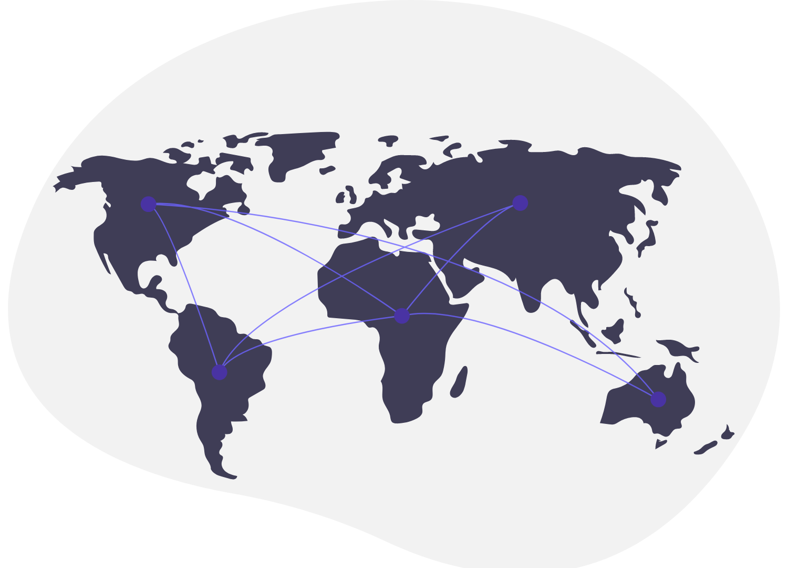
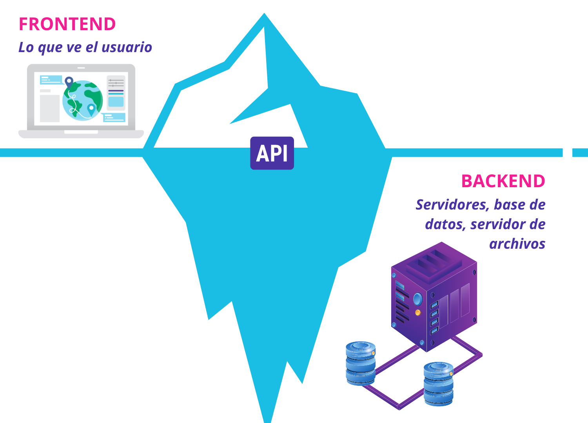

# ¿Cómo funciona Internet?

Antes de que podamos empezar a aprender sobre todas las tecnologías y herramientas a ser utilizadas en este curso, necesitamos aprender:

1. Cómo funciona la web, 
2. Y qué constituye exactamente el desarrollo Full Stack.

## ¿Qué pasa cuándo abrimos el navegador y visitamos una página web?

Al escribir la dirección de cualquier sitio, **la computadora envía una solicitud como un paquete que incluye la dirección IP del sitio web al cual querés acceder.** Una dirección IP es un identificador de la red. 

La dirección IP permite a los servidores identificar a qué sitio web queremos tener acceso, y **manda las solicitudes a través de cables o satelites que eventualmente se conectan a cables utilizando tu servicio de Internet.**

En un nivel muy básico, **Internet es básicamente la conexión de cables a computadoras con un protocolo específico.** 

Si tu solicitud llega al servidor, este responde enviando de vuelta el sitio web que solicitaste. Como el contenido que solicitaste es muy grande y no se puede enviar de una sola vez, el servidor envía el contenido solicitado en diferentes **paquetes de datos**, que luego se vuelven a juntar para armar el contenido nuevamente.

**A los paquetes no les importa cómo llegan a vos, sino la manera más rápida en llegar.** Estos paquetes podrían tomar diferentes rutas para llegar a tu dispositivo, con tal de llegar rápido.

Esto es todo lo que necesitamos saber por ahora sobre cómo funciona Internet.

## ¿Qué es Full Stack?

Hay dos componentes principales de un sitio web: La parte **Front-End** de un sitio y la parte **Back-End.** 

La front-end es la **parte que el usuario puede ver en el sitio** (lo que se ve), y el back-end es **la parte encargada de los mecanismos y la lógica** (lo que no se ve).

Por ejemplo, cuando entramos a Facebook, podemos ver los colores y el formato del contenido, eso sería la parte del front-end; la parte del back-end es la que decide qué contenido mostrar, y saca toda esta información alojada en una base de datos. 

**La parte de front-end usualmente requiere el uso de estas tres tecnologías:**
1. HTML
2. CSS
3. Javascript

* HTML significa lenguaje de marcado de hipertexto, y se usa en todas las páginas web. Es la estructura del sitio y podés verla al hacer click derecho en cualquier parte de la página y seleccionando inspeccionar, o ver código fuente.

* CSS significa Cascading Style Sheets. Con CSS se definen cuestiones del sitio web como colores, fuentes, bordes, etc. Casi todos los sitios web lo tienen para que luzcan lindos.

* Javascript nos permite interactuar con el sitio web. Sin javascript, el sitio no seria interactivo y quedaria como un un documento simple, sin botones, movimiento o acciones. 

Para cualquier sitio, siempre se utilizan estas herramientas de front-end. Es en el área de backend donde hay una gran variedad de opciones y herramientas que se pueden utilizar. 

