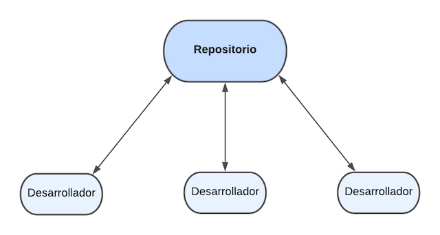

# Control de versiones

El control de versiones, también conocido como "control de código fuente", es la práctica de rastrear y gestionar los cambios en el código de software. Los sistemas de control de versiones son herramientas de software que ayudan a los equipos de software a gestionar los cambios en el código fuente a lo largo del tiempo.

El software de control de versiones realiza un seguimiento de todas las modificaciones en el código en un tipo especial de base de datos. Si se comete un error, los desarrolladores pueden ir hacia atrás en el tiempo y comparar las versiones anteriores del código para ayudar a resolver el error, al tiempo que se minimizan las interrupciones para todos los miembros del equipo.


## ¿Por qué usar un sistema de control de versiones?

El control de versiones protege el código fuente tanto de las catástrofes como del deterioro casual de los errores humanos y las consecuencias accidentales.

Un desarrollador del equipo podría estar trabajando en una nueva función mientras otro desarrollador soluciona un error no relacionado cambiando código. Cada desarrollador podría hacer sus cambios en varias partes de la estructura del proyecto. El control de versiones ayuda a los equipos a resolver este tipo de problemas al realizar un seguimiento de todos los cambios individuales de cada colaborador y al contribuir a evitar que el trabajo concurrente entre en conflicto.

## Ventajas de los sistemas de control de versiones

- Ayudan a los desarrolladores a moverse más rápido y permite que los equipos de software mantengan la eficiencia y la agilidad a medida que el equipo se escala para incluir más desarrolladores.
- Dan la posibilidad de tener un historial completo de cambios a largo plazo de todos los archivos. Esto quiere decir, todos los cambios realizados por muchas personas a lo largo de los años. Los cambios incluyen la creación y la eliminación de los archivos, así como los cambios de sus contenidos.
- Creación de ramas y fusiones. La creación de una "rama" en las herramientas de control de versiones mantiene múltiples flujos de trabajo independientes los unos de los otros al tiempo que ofrece la facilidad de volver a fusionar ese trabajo, lo que permite que los desarrolladores verifiquen que los cambios de cada rama no entran en conflicto.
- Trazabilidad. Da la posibilidad de trazar cada cambio que se hace en el software a la vez que da la posibilida de anotar cada cambio con un mensaje que describa el propósito y el objetivo del cambio.

Para más información podés visitar el portal de [Atlassian](https://www.atlassian.com/es/git/tutorials/what-is-version-control){:target="_blank"} que habla sobre los sistemas de control de versiones.

# Git
Es el sistema de control de versiones moderno más utilizado del mundo.

Git permite mantener el flujo de trabajo mediante ramas:


Git es un sistema de control de versiones distribuido. Esto quiere decir que cada desarrollador tiene su propio repositorio local con un historial completo de los cambios.



## Instalación de Git

Existen muchas formas de usar Git. Por un lado tenemos las herramientas originales de línea de comandos, y por otro lado tenemos una gran variedad de interfaces de usuario con distintas capacidades. Nosotros vamos a usar la línea de comandos, del cual ya se habló en la sección de [Herramientas](/2_herramientas/1_Herramientas.html#opciones-de-l%C3%ADnea-de-comandos-cli-populares){:target="_blank"}.

### Linux
Para  instalar Git en Linux en  general puedes hacerlo mediante la herramienta básica de administración de paquetes que trae tu distribución. Si estás en Fedora por ejemplo, puedes usar `yum`:

```bash
$ yum install git
```
Si estás en una distribución basada en Debian como Ubuntu, puedes usar `apt-get`:

```bash
$ apt-get install git
```

Para opciones adicionales, la [página web de Git](http://git-scm.com/download/linux){:target="_blank"} tiene instrucciones de instalación en diferentes tipos de Unix.

### Windows
La forma más oficial está disponible para ser descargada en el sitio web de Git. Solo tienes que visitar [http://git-scm.com/download/win](http://git-scm.com/download/win){:target="_blank"}.


# Introducción a GitHub y comandos básicos de Git

Esta lección cubre los conceptos básicos de GitHub, una plataforma para alojar y administrar cambios en tu código.


## Prerrequisitos

Antes de comenzar, debemos verificar si Git está instalado. Escribí en tu terminal:
```bash
git --version
```

Si Git no está instalado, [descargá Git desde acá](https://git-scm.com/downloads){:target="_blank"}. Luego, configurá tu perfil de Git local en la terminal:
```bash
git config --global user.name "tu-nombre"
git config --global user.email "tu-email"
```

Para comprobar si Git ya está configurado, escribí:
```bash
git config --list
```

También vas a necesitar una cuenta de GitHub, un editor de código (como Visual Studio Code) y una terminal (tambien conocida como línea de comandos o símbolo del sistema).

Ve a [GitHub.com](https://github.com/){:target="_blank"} y creá una cuenta si aún no lo has hecho, o iniciá sesión y completá tu perfil.

✅ GitHub no es el único lugar para almacenar codigo; hay otros, pero GitHub es el más conocido.

## Preparación

Vas a necesitar una directorio con un proyecto de código en tu máquina local (computadora portátil o PC) y un repositorio público en GitHub, que te servirá como ejemplo de cómo contribuir a los proyectos de otros.

---

## Gestión de código

Digamos que tenés un directorio local con algún proyecto de código y deseás rastrear tu progreso usando git. Al leer tus mensajes de confirmación días, semanas o meses después, podrás recordar por qué tomaste una decisión o "revertiste" un cambio, siempre y cuando escribas buenos mensajes a la hora de enviar un commit.

# Tarea: Crear un repositorio git y enviar código

Para esto vamos a usar de ejemplo un proyecto que te va a servir como porfolio de los proyectos que realices durante el bootcamp. Este portfolio va a ser una página HTML simple (sobre HTML vamos a hablar en las siguientes clases), que vas a levantar primeramente en Github y luego a un servidor para que cualquier persona en Internet pueda verlo.

1. **Crear repositorio en GitHub**. En GitHub.com, en la pestaña de repositorios, o en la barra de navegación superior derecha, busca el botón **nuevo repositorio**.

    - Dale un nombre a tu repositorio (directorio)
    - Seleccioná **Crear Repositorio**.

2. **Navegá a tu directorio de trabajo**. En tu terminal, vas a crear un nuevo directorio donde va a estar alojado tu proyecto de porfolio. Tenés que navegar hasta donde querés que esté el proyecto y crear el directorio. Para moverte entre la carpetas o navegar escribí:

   ```bash
   cd [/ruta/a/un/directorio ]
   ```

   Para que te sea más fácil reconocer podés igualar el nombre de tu directorio con el de tu proyecto en Github. Para crear el directorio escribí:
   ```bash
   mkdir [nombre del proyecto]
   ```

   Luego movete al directorio recién creado:

   ```bash
   cd [nombre de tu proyecto]
   ```

3. **Inicializar un repositorio de git**. En el directorio de tu proyecto escribí:

   ```bash
   git init
   ```

4. **Creá el archivo para tu portfolio**. En la terminar escribí:

   Linux:
   ```bash
   touch index.html
   ```

   Windows:
   ```bash
   type NUL >> index.html
   ```

   Esto va a crear un archivo HTML que va a representar a tu portfolio.

5. **Abrir el archivo**. Si estás usando Visual Studio Code podés abrir el archivo desde la terminal escribiendo:
   ```bash
   code index.html
   ```

6. **Código del portfolio**. Hasta ahora todavía no vimos lo que es un archivo HTML, ya lo vamos a hacer más adelante, de momento escribí esto dentro del archivo `index.html`:

   ```html
   <!DOCTYPE html>
   <html>
   <head>
      <title>Mi Portfolio</title>
      <meta charset="utf-8" />
      <meta http-equiv="X-UA-Compatible" content="IE=edge" />
      <meta name="viewport" content="width=device-width, initial-scale=1" />
   </head>
   <body>
      <h1>MiniBootcamp - Portfolio</h1>
      <h2>Nombre: nombre_completo</h2>
      <h3>Proyectos:</h3>
      <ul>
      <li>Proyeto1:</li>
      <li>Proyecto2:</li>
      <li>Proyecto3:</li>
      </ul>
   </body>
   </html>
   ```
   Reemplazá donde dice `nombre_completo` por tu nombre.


7. **Comprobar estado**. Para comprobar el estado del proyecto escribí:

   ```bash
   git status
   ```

   La respuesta de la terminal (CLI) probablemente se verá así:

   ```bash
   Changes not staged for commit:
   (use "git add <file>..." to update what will be committed)
   (use "git checkout -- <file>..." to discard changes in working directory)

        modified:   index.html
   ```

   Por lo general, el comando `git status` nos avisa qué archivos están listos para ser guardados en el repositorio o cambios en tu codigo que puedes conservar.

8. **Agregar archivos al seguimiento**

   ```bash
   git add .
   ```

   El comando `git add` más `.` indica que todos tus archivos y cambios de este directorio están listos para darles seguimiento. Si querés agregar todos los archivos de todos los directorios de tu proyecto el comando es `git add -A`.

9. **Agregar archivos puntuales**

   ```bash
   git add [nombre de archivo o carpeta]
   ```

   Esto nos ayuda a agregar sólo los archivos seleccionados al área de preparación cuando no queremos confirmar todos los archivos a la vez.


10. **Eliminar archivos de la zona de staging**

      ```bash
      git reset
      ```

      Este comando nos ayuda a eliminar todos los archivos a la vez. Ojo, no borra tus archivos, sólo los saca del estado de staging.


11. **Quitar un archivo en particular**
      ```bash
      git reset [nombre del archivo o carpeta]
      ```

      Este comando nos ayuda a eliminar un archivo/directorio puntual, para que este no sea enviado en el proximo commit.


12. **Persistir tu trabajo**. En este punto, has agregado los archivos a lo que se denomina _stagin area_. Un lugar donde Git rastrea tus archivos. Para que el cambio sea permanente, debes realizar un _commit_    
      Para hacerlo, se utiliza  el siguiente commando: `git commit`. Un _commit_ representa un punto en el historial de tu repositorio que estás guardando, este viene acompañado de un mensaje, el cual nos sirve para saber qué cambios se hicieron dentro de ese commit. Ejecuta el siguiente comando para realizar tu primer commit.

      ```bash
      git commit -m "primer commit"
      ```

      Esto confirma todos tus archivos, agregando el mensaje "primer commit". Para futuros mensajes de confirmación, querrás ser más descriptivo en tu descripción para transmitir qué tipo de cambio has realizado.

13. **Conecta tu repositorio de Git local con GitHub**. Es bueno tener un repositorio de Git en tu máquina, pero también tienes que guardar todos estos archivos en algún lugar e invitar a otras personas a trabajar contigo en tu repositorio. Un buen lugar para hacerlo es GitHub. Recuerda que ya hemos creado un repositorio en GitHub, por lo que lo único que debemos hacer es conectar nuestro repositorio de Git local con GitHub. El comando `git remote add` hará precisamente eso. Escribe el siguiente comando:

      > Nota, antes de escribir el comando, ve a la página de tu repositorio de GitHub para encontrar el URL del repositorio. Lo usarás en el siguiente comando. Reemplaza `nombre_repositorio` con tu URL de GitHub.

      ```bash
      git remote add origin https://github.com/USUARIO/NOMBRE_DEL_REPOSITORIO.git
      ```

      Esto crea un _remote_, o conexión, llamado "origin" que apunta al repositorio de GitHub que creaste anteriormente.

14. **Envía archivos locales a GitHub**. Hasta ahora ha creado una _conexión_ entre el repositorio local y el repositorio de GitHub. Enviemos estos archivos a GitHub con el siguiente comando `git push`, así:

      ```bash
      git push -u origin master
      ```

      Esto envía una confirmación en tu rama "master" en GitHub.

15. **Para agregar más cambios**. Si deseas continuar haciendo cambios y enviarlos a GitHub, solo necesitas usar los siguientes tres comandos:
      
      ```bash
      git add .
      git commit -m "escribe tu mensaje de confirmación aquí"
      git push
      ```

      > Sugerencia: es posible que también desees adoptar un archivo `.gitignore` para evitar que los archivos que no deseas rastrear aparezcan en GitHub. Puedes encontrar plantillas para archivos `.gitignore` en [.gitignore templates](github.com/github/gitignore){:target="_blank"}.


# Tarea: Mejora del repositorio

   Aquí hay algunas cosas que pueden mejorar tu repositorio de GitHub:
   - **Descripción**. ¿Agregaste una descripción para tu proyecto?
   - **README**. ¿Agregaste un archivo README? El Readme es lo primero que se muestra al entrar en un proyecto en Github. GitHub proporciona una guía para escribir un [README](https://docs.github.com/articles/about-readmes/){:target="_blank"}.


✅ Los archivos README, aunque requieren tiempo para prepararse, a menudo son descuidados por los mantenedores. ¿Puedes encontrar un ejemplo de uno particularmente descriptivo? Nota: aquí hay algunas [herramientas para ayudar a crear buenos archivos READMEs](https://www.makeareadme.com/){:target="_blank"} que podés probar.


# Tarea: Comandos extras de Git

<!-- Los documentos que contribuyes ayudan a las personas a contribuir al proyecto. Explica qué tipos de contribuciones estás buscando y cómo funciona el proceso. Los colaboradores deberán seguir una serie de pasos para poder contribuir a tu repositorio en GitHub:

1. **Bifurcando (forking) tu repositorio** Probablemente querrás que la gente _bifurque_ (fork) tu proyecto. Bifurcar significa crear una réplica de tu repositorio en su perfil de GitHub.
1. **Clonar**. Desde allí, clonarán el proyecto en su máquina local.
1. **Crear una rama**. Querrás pedirles que creen una _ rama_ para su trabajo.
1. **Concentre su cambio en un área**. Pida a los colaboradores que concentren sus contribuciones en una cosa a la vez; de esa manera, las posibilidades de _fusionar_ su trabajo son mayores. Imagínate que escriben una corrección de errores, agregan una nueva función y actualizan varias pruebas; ¿qué sucede si quieres todos los cambios o solo puedes implementar 2 de 3 o 1 de 3 cambios? -->

A continuación veremos algunos comando extras que te serán de utilidad en el futuro.

1. **Clonación de proyecto**. Clonar un proyecto significa que tengas tu propia copia del todo el proyecto de forma local en tu máquina, para ello el comando a utilizar es:
   ```bash
   git clone [nombre del repositorio]
   ```

2. **Rama**. Las ramas son versiones del código de tu proyecto. Ayudan a mantener el orden y manipular el código de forma segura. Por lo general se crean nuevas ramas para por ejemplo probar nueva ideas, agrear funcionalidad o incluo experimentar sin impactar sobre el proyecto principal.

   ✅ Imagínate una situación en la que las ramas (branches) de git son particularmente críticas para escribir y enviar buen código. ¿Qué casos de uso se te ocurren?

   > Creá también ramas  para tu propio trabajo. Todas las confirmaciones que realices se realizarán en la rama en la que estás actualmente "registrado". Usa `git branch` para ver qué rama es.

   Para crear una nueva rama y mudarnos a la misma usamos el comando `git checkout`:

   ```bash
   git checkout -b [nombre de rama]
   ```

1. **Trabaja**. En este punto, deseas agregar tus cambios. No olvides informarle a Git con los siguientes comandos:

   ```bash
   git add .
   git commit -m "mis cambios"
   ```

   Asegúrate de darle una buena descripción a tu commit.

1. **Combina tu trabajo con la rama `principal`**. En algún momento has terminado de trabajar y deseas combinar tu trabajo con el de la rama `principal`. La rama `master` podría haber cambiado mientras tanto, así que asegúrate de actualizarla con los siguientes comandos:

   ```bash
   git checkout master
   git pull
   ```

   En este punto, querrás asegurarte de que cualquier _conflicto_, situaciones en las que Git no pueda _combinarse_ fácilmente los cambios, ocurren en tu rama de trabajo. Mientras tanto, ejecuta los siguientes comandos:

   ```bash
   git checkout [nombre de rama]
   git merge master
   ```

   Esto traerá todos los cambios de `master` a tu rama y es de esperar que puedas continuar. De lo contrario, VS Code te dirá dónde está _confundido_ Git y simplemente modificará los archivos afectados para decir qué contenido es el más preciso.

1. **Envía tu trabajo a GitHub**. Enviar tu trabajo a GitHub significa dos cosas. Empujar tu rama a tu repositorio y luego abrir un PR (Pull Request).

   ```bash
   git push origin [nombre de rama]
   ```

   El comando anterior crea la rama en tu repositorio.

1. **Abre un PR**. A continuación, abre un PR. Para hacerlo, navega a tu repositorio en GitHub. Verás una indicación en GitHub donde te preguntarán si deseas crear un nuevo PR. Haz clic en eso y te llevará a una interfaz donde puedes cambiar el título del mensaje de confirmación, asignarle una descripción más adecuada. Ahora, el mantenedor del repositorio verá este PR y _fusionarán_ tu PR. De momento sos el mantenedor y el colaborador (el que hace el PR), pero esta es la manera en la que se llevan a cabo los trabajos colaborativos.

Actualiza tu rama de trabajo local actual con todas las nuevas confirmaciones de la rama remota correspondiente en GitHub: `git pull`

# Revisión y autoestudio

En Internet hay mucha material para aprender Git, pero la clave para manejarlo es práctica, mucha práctica.
[Git Branching](https://learngitbranching.js.org/?locale=es_ES){:target="_blank"} es un proyecto interactivo que puede ayudarte a mejorar tus conocimientos sobre Git.

Algunas referencias extras:
- [Hoja de referencia de Git](https://training.github.com/downloads/github-git-cheat-sheet/){:target="_blank"}, esto está en inglés.
- [Primera semana en GitHub](https://lab.github.com/githubtraining/first-week-on-github){:target="_blank"} también en inglés.
- [Documentación de Atlassian](https://www.atlassian.com/es/git/tutorials/setting-up-a-repository){:target="_blank"}

