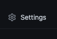
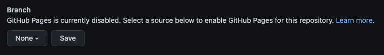
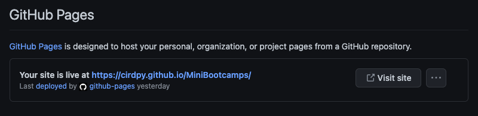
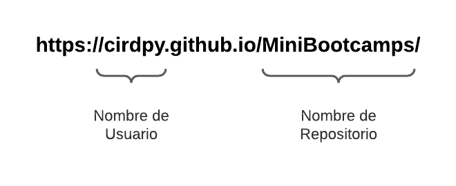

# Github Pages

Se trata de un servicio de hosting de sitios proveído por Github. Toma los archivos HTML, CSS y JavasScript directo desde el repositorio en Github, esto de manera a publicar el sitio web.

---
# Creación del repositorio y carga de archivos

1. En la esquina superior derecha de cualquier página vamos a encontrar las opciones para crear nustro repositorio, seleccionamos el menú desplegable que muestra el ícono + y elegimos la opción New repository ( o Nuevo repositorio).
 
 
{: .center-image}
 

2. Escribimos el nombre de nuestro repositorio nombre.github.io reemplazando **nombre** por el nombre que elijamos para nuestro proyecto en GitHub según corresponda. Por ejemplo, si el nombre de este repositorio es octocat, lo que va a dar como resultado posteriormente octocat.github.io.
 
 
{: width="650" }{: .center-image}
 
3. Luego vamos a la página principal del repositorio, y una vez ahí hacemos clic en Upload files (Cargar archivos) mediante la lista desplegable Add file (Agregar archivo).
  
{: width="650"}{: .center-image}
 
4. Arrastra y suelta el archivo o la carpeta que te gustaría cargar en tu repositorio en el árbol del archivo.
  
{: width="650"}{: .center-image}
 
5. En la parte inferior de la página, teclea un mensaje de confirmación corto y significativo que describa el cambio que realizaste al archivo.
  
{: width="650"}{: .center-image}
 
6. Haga clic en Commit changes (Confirmar cambios).
  
{: width="650"}{: .center-image}

---
# Publicación en Internet

Lo primero que debés tener antes de publicar tu sitio web es el contenido albergado en un repositorio de Github.

Vamos a proceder a publicar en internet tu proyecto del portfolio, para ello debe estar ya en su repositorio en Github.

### 1. Configuración
Seleccioná tu repositorio de portfolio en Github y hacé clic en la opción "Setting" (Configuraciones) de tu repositorio:
 
 
{: .center-image}

### 2. Pages
Luego en el menú lateral seleccioná la opción "Pages" (Páginas).
 
 
{: .center-image}

### 3. Rama
Casi al inicio aparece la sección que dice "Branch" (Rama), en esta sección es necesario seleccionar cuál va a ser la rama desde la cual queremos que se haga la publicación. Debería verse algo así:
 
 
{: .center-image}

Luego de seleccionar tu rama, debés guardar tus cambios, simplemente pulsando al botón que dice "Save" (Guardar).

### 4. Refrescar
Toma un momento hacer la publicación, luego de un rato podés refrescar tu navegador y ya debería aparecerte algo como esto:
 
 
{: .center-image}

Así en cuatro sencillos pasos, tu web de portfolio ya se encuentra disponible en Internet.

## Consideraciones finales

Fijate en la URL que te asigna Github Pages.
 
 
{: .center-image}

La primera parte del dominio corresponde a tu nombre de usuario en Github, mientras que el "path" de la URL corresponde con el nombre de tu repositorio.

Esta combinación de nombre de usuario + repositorio es único; de hecho Github no te va a permitir que tengas dos repositorios con el mismo nombre.
