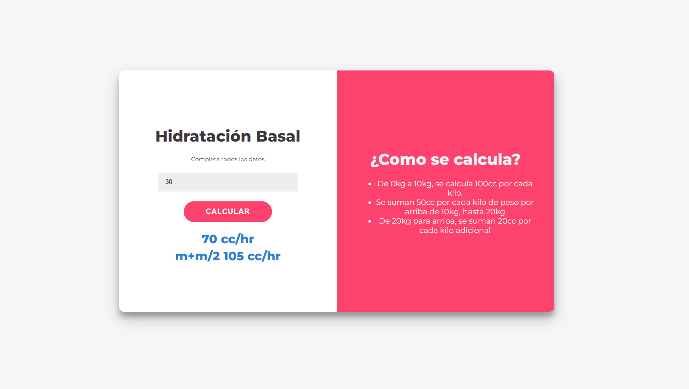

# Proyecto Calculadora de hidratación basal
{: .no_toc }

En los hospitales, los enfermeros y doctores necesitan calcular la cantidad de líquidos que necesita cada paciente. En hospitales modernos cada paciente tiene un monitor donde ya está indicado este dato y muchos otros, como la dosis correcta de los distintos medicamentos.

Pero en los hospitales nacionales de Paraguay, no contamos con estos equipos, y el personal medico debe hacer los cálculos a mano antes de aplicar el suero a un paciente.

Desde la unidad de pediatría del hospital nacional de Santani, nos pidieron ayuda para desarrollar una calculadora que les permita obtener los resultados de forma rápida y confiable.

Con esta herramienta se busca ahorrar tiempo y reducir errores.

Concretamente nos pidieron que desarrollemos una calculadora que a partir del peso del paciente determine la cantidad minima de líquidos que necesita un paciente, esto se llama **hidratación basal**

    <iframe src="https://drive.google.com/file/d/1EGK_4Vc4HcHapL4_BRtyFkhEYVkeY6TR/preview" width="640" height="450" allow="autoplay"></iframe>

## Hidratación basal

La hidratación basal es la cantidad de líquidos que una persona requiere en 24 horas para mantener una hidratación de mantenimiento, que es lo que mantiene el medio interno del organismo y permite que el resto de los sistemas funcionen.

## El calculo

En la unidad de pediatría se manejan dos formas de calcular la hidratación de mantenimiento:
* Cuando el niño tiene hasta 30kg: Se utiliza el calculo de Holliday-Segar.
* Cuando el niño tiene mas de 30kg: Se calcula la hidratación basal usando el método de superficie corporal

### Método Holliday-Segar

Se calcula de la siguiente manera:
* Cuando el niño tiene hasta 10kg: 100cc por cada kilo.
* Luego, por cada kilo arriba de 10 y hasta 20kg, se suman 50cc.
* Finalmente, por cada kilo arriba de 20kg se suman 20cc.

El resultado de este calculo es el volumen diario de liquido que el paciente necesita, en cc o ml.

#### Ejemplo:

Si un niño pesa 25kg:
* Para los primeros 10kg hacemos 10*100 = 1000cc.
* Los siguientes 10kg entran en la siguiente franja, asi que hacemos 10*50 = 500cc.
* Finalmente nos quedan 5kg por arriba de 20kg, asi que vamos a calcular 5*20 = 100cc.
* Sumamos todos nuestros resultados y obtenemos un volumen diario de **1600cc**.

Ya tenemos el resultado final que es el volumen diario, pero los equipos que se utilizan para dosificar el suero funcionan con flujo horario.

Para calcular el flujo horario hacemos el volumen diario / 24hr, de esta forma 1600cc equivalen a **67cc/hr**. Este valor también se conoce como mantenimiento.

Por otro lado, es muy común que el medico indique un mantenimiento un poco superior al calculado, asi que ademas de mostrar el volumen diario y el mantenimiento, tenemos que mostrar el valor conocido como m+m/2 (mantenimiento + medio mantenimiento).

* m+m/2 es simplemente el **mantenimiento x 1.5**, en el ejemplo anterior es **100cc/hr**.

| Peso        | Volumen diario    | Mantenimiento | m+m/2    |
|:------------|:------------------|:--------------|:---------|
| 9           | 900 cc            | 38 cc/hr      |57 cc/hr  |
| 15          | 1250 cc           | 52 cc/hr      |78 cc/hr  |
| 20          | 1500 cc           | 63 cc/hr      |94 cc/hr  |
| 29          | 1680 cc           | 70 cc/hr      |105 cc/hr |
  
### Método de superficie corporal

Cuando el niño pesa mas de 30kg, se utiliza un cálculo diferente:

`Superficie corporal = ( (peso * 4) + 7) / (peso + 90)`

Este resultado se multiplica por 1500 o por 2000 para hallar el valor del volumen diario en cc, y el medico decide cual de los dos resultados utilizar.

## Requerimientos

Se plantea el siguiente diseño para la calculadora:

Finalmente, para que este producto se pueda utilizar se plantean los siguientes requerimientos:

* Se debe poder ingresar el peso, y debe ser claro en que unidad de medida (el estándar es kg).
* Al calcular se deben mostrar los siguientes resultados:
  * Para menores de 30kg se calcula por Holliday-Segar:
    * Volumen diario en cc.
    * Mantenimiento en cc/hr.
    * m+m/2.
  * Para mayores de 30kg se calcula por SC:
    * SC * 1500
    * SC * 2000
* Se debe indicar el método utilizado y como se hizo el calculo.

# Implementación del proyecto

Si bien este es un proyecto pensado para que un principiante pueda aprender los principio de programación, se trata de un proyecto real que resuelve una necesidad real.

Por este motivo, al terminar el curso un proyecto sera seleccionado para implementarse en el hospital donde hicieron el pedido.

El mismo *cliente* será el que seleccione el proyecto *ganador*, y su pagina web sera seleccionada para usarse en el hospital todos los días!

Los criterios que el cliente utilizara para la selección son de estética y usabilidad.

Asi que esforzate por hacer una solución que funcione bien y sea atractiva!

