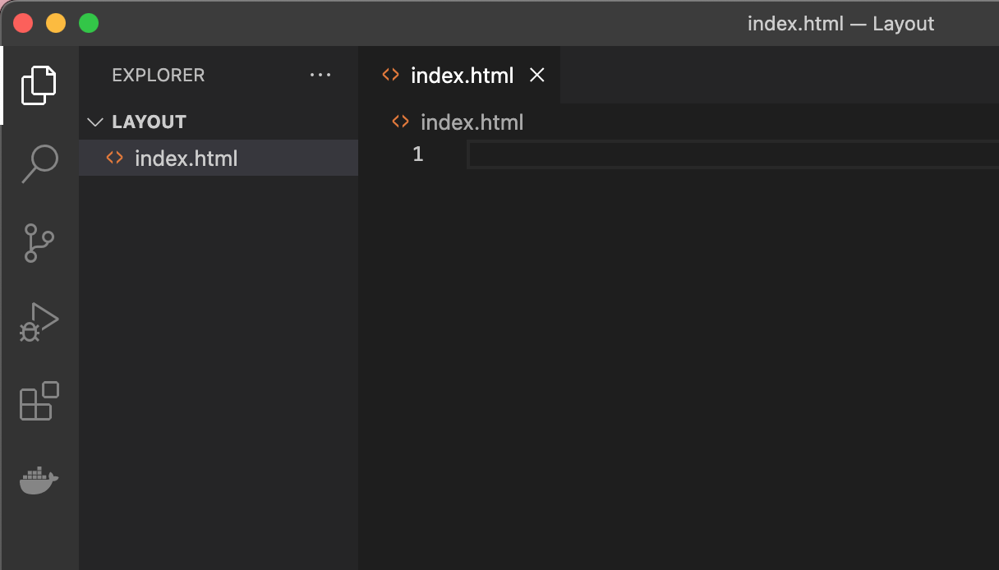
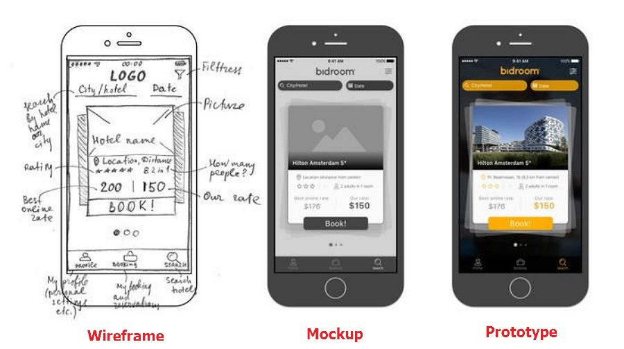

# Proyecto de Diseño Parte 1: Introducción a HTML

# Introducción:

HTML, o HyperText Markup Language, es el "esqueleto" de la web. Si CSS 'viste' tu HTML y JavaScript le da vida, el cuerpo de tu aplicación web es tu HTML. La sintaxis de HTML incluso refleja esa idea, ya que incluye etiquetas "head" (cabeza), "body" (cuerpo) y "footer" (pie).

Para esta lección y las siguientes usaremos como ejemplo el diseño de un detalle de un producto en un [e-commerce](https://www.visa.com.py/dirija-su-negocio/pymes/notas-y-recursos/tecnologia/que-es-ecommerce-o-comercio-electronico.html){:target="_blank"}. Es el caso cuando seleccionás un producto que deseás comprar. Podés buscar ejemplos en e-commerces bien conocidos como Amazon, e-Bay, Forever21, etc.

Usaremos HTML para diseñar el 'esqueleto' de la interfaz de nuestro detalle de producto. Tendrá un título y tres columnas: una columna izquierda donde viven los componentes, una columna derecha donde viven los productos de ejemplo, todos estos que se pueden arrastrar; y un área central que será el espacio para que diseñes tu [layout](https://www.significados.com/layout/){:target="_blank"}. Al final de esta lección, podrás ver los elmentos en la columna, pero la interfaz se verá un poco extraña; no te preocupes, en la siguiente sección agregarás estilos CSS a la interfaz para que se vea mejor.

### Tarea:

En tu computadora, creá una carpeta llamada 'Layout' y dentro de ella, un archivo llamado 'index.html'. Podés hacer esto en Visual Studio Code después de crear tu carpeta del proyecto abriendo una nueva ventana de VS Code, haciendo clic en 'abrir carpeta' y navegando a tu nueva carpeta. Hacé clic en el botón pequeño 'archivo' en el panel del Explorador y creá el nuevo archivo:



> Los archivos index.html indican a un navegador que es el archivo predeterminado en una carpeta; las URL como `https://anysite.com/test` se pueden construir usando una estructura de carpetas que incluya una carpeta llamada `test` con `index.html` dentro; `Index.html` no tiene que aparecer en una URL.

---

## 1. Las etiquetas DocType y html

La primera línea de un archivo HTML es su doctype. Es un poco sorprendente que necesite tener esta línea en la parte superior del archivo, pero le dice a los navegadores más antiguos que el navegador necesita representar la página en un modo estándar, siguiendo la especificación html actual.

> Consejo: en VS Code, puedes colocar el cursor sobre una etiqueta y obtener información sobre su uso en las guías de referencia de MDN.

La segunda línea debe ser la etiqueta de apertura de la etiqueta `<html>`, seguida ahora por su etiqueta de cierre. Estas etiquetas son los elementos raíz de su interfaz.

### Tarea:

Agregá estas líneas en la parte superior de tu archivo `index.html`:


```HTML
<!DOCTYPE html>
<html></html>
```

✅ Hay algunos modos diferentes que se pueden determinar configurando DocType con una cadena de consulta: [Modo Quirks y Modo estándar](https://developer.mozilla.org/es/docs/Web/HTML/Quirks_Mode_and_Standards_Mode){:target="_blank"}. Estos modos solían admitir navegadores realmente antiguos que no se utilizan normalmente en la actualidad (Netscape Navigator 4 e Internet Explorer 5). Puedes ceñirte a la declaración de tipo de documento estándar.

---

## 2. El 'encabezado' del documento

El área 'encabezado' del documento HTML incluye información crucial sobre tu página web, también conocida como [metadatos](https://developer.mozilla.org/es/docs/Web/HTML/Element/meta){:target="_blank"}. En nuestro caso, le decimos al servidor web al que se enviará esta página para que sea renderizada cuatro cosas:

- el título de la página
- metadatos de la página que incluyen:
    - el 'conjunto de caracteres', que indica qué codificación de caracteres se utiliza en la página.
    - información del navegador, incluido `x-ua-compatible`, que indica que el navegador IE = edge es compatible.
    - información sobre cómo debería comportarse la ventana gráfica cuando se carga. Configurar la ventana gráfica para que tenga una escala inicial de 1 controla el nivel de zoom cuando la página se carga por primera vez.


### Tarea:

Agregá un bloque de 'encabezado' a tu documento entre las etiquetas de apertura y cierre `<html>`.

```html
<head>
	<title>Diseño de Interfaces</title>
	<meta charset="utf-8" />
	<meta http-equiv="X-UA-Compatible" content="IE=edge" />
	<meta name="viewport" content="width=device-width, initial-scale=1" />
</head>
```

✅ ¿Qué pasaría si configurás una metaetiqueta de ventana gráfica como esta: `<meta name =" viewport "content =" width = 600 ">`? Obtené más información sobre [viewport](https://developer.mozilla.org/en-US/docs/Web/HTML/Viewport_meta_tag){:target="_blank"}.

---

## 3. El `cuerpo` del documento

# Etiquetas HTML

En HTML, agregamos etiquetas al archivo .html para crear elementos de una página web. Cada etiqueta generalmente tiene una etiqueta de apertura y cierre, como esta: `<p>hola</p>` para indicar un párrafo. Creá tu interfaz `<body>` agregando un conjunto de etiquetas dentro del par de etiquetas `<html>`; tu marcado ahora se ve así:

## Tarea:

```html
<!DOCTYPE html>
<html>
	<head>
        <title>Diseño de Interfaces</title>
        <meta charset="utf-8" />
        <meta http-equiv="X-UA-Compatible" content="IE=edge" />
        <meta name="viewport" content="width=device-width, initial-scale=1" />
    </head>
	<body></body>
</html>
```

Ahora podés comenzar a construir tu página. Normalmente, usás etiquetas `<div>` para crear los elementos separados en una página. Crearemos una serie de elementos `<div>` que contendrán imágenes.

# Imágenes

Una etiqueta html que no necesita una etiqueta de cierre es la etiqueta ``, porque tiene un elemento `src` que contiene toda la información que la página necesita para representar el elemento.

Creá una carpeta en tu aplicación llamada `images` y en ella, agregá todas las imágenes de la [carpeta del código fuente](/assets/images/layout.zip){:target="_blank"}; (hay 20 imágenes en total).


# Tarea:

Agregá estas imágenes de elementos en dos columnas entre las etiquetas `<body> </body>`: una columna para los componentes del layout, y otra para los potenciales productos.


```html
<div id="pagina">
    <div id="tablero-izquierdo" class="tablero">
        <div class="contenedor">
            
        </div>
        <div class="contenedor reducido">
            
        </div>
        <div class="contenedor">
            
        </div>
        <div class="contenedor">
            
        </div>
        <div class="contenedor reducido">
            
        </div>
        <div class="contenedor reducido">
            
        </div>
        <div class="contenedor">
            
        </div>
        <div class="contenedor">
            
        </div>
        <div class="contenedor">
            
        </div>
        <div class="contenedor">
            
        </div>
        <div class="contenedor reducido">
            
        </div>
        <div class="contenedor">
            
        </div>
        <div class="contenedor">
            
        </div>
        <div class="contenedor">
            
        </div>
        <div class="contenedor">
            
        </div>
        <div class="contenedor">
            
        </div>
    </div>
    <div id="tablero-derecho" class="tablero">
        <div class="contenedor2">
            
        </div>
        <div class="contenedor2">
            
        </div>
        <div class="contenedor2">
            
        </div>
        <div class="contenedor2">
            
        </div>
    </div>
</div>
```

> Nota: Spans vs. Divs. Los Divs se consideran elementos de 'bloque' y los Spans están 'en línea'. ¿Qué pasaría si transformaras estos divs en spans?

Con este código, los componentes ahora aparecen en la pantalla. Se ve bastante mal porque aún no están los "estilos", que se escriben en CSS , cosa que haremos en la próxima lección.

Cada imagen tiene una etiqueta alt que aparecerá incluso si no se puede mostrar una imagen. Este es un elemento importante a incluir para la accesibilidad. Por ahora, recordá que es importante permitir que los usuarios con discapacidad visual puedan utilizar tu sitio web.

✅ ¿Notaste que cada imagen tiene la misma etiqueta alt (uno para los componentes y otro para los productos)? ¿Es esta una buena práctica? ¿Por qué o por qué no? ¿Podés mejorar este código?

---

## 4. Marcado semántico

En general, es preferible usar 'semántica' significativa al escribir HTML. Qué significa eso? Significa que tenemos que utilizar las etiquetas HTML de la forma en que fueron diseñadas. Por ejemplo, el título principal en una página debería usar siempre una etiqueta `<h1>`.

Agregá la siguiente línea justo debajo de tu etiqueta de apertura `<body>`:

```html
<h1>Detalle de Producto</h1>
```

El uso de marcado semántico, como que los encabezados sean `<h1>` y las listas no ordenadas se representen como `<ul>`, ayuda a los lectores de pantalla a navegar por una página. En general, los botones deben escribirse como `<button>` y las listas deben ser `<li>`. Si bien es _posible_ usar elementos `<span>` de estilo especial con controladores de clic para simular botones, es mejor para los usuarios con capacidades diferentes usar tecnologías para determinar en qué parte de una página reside un botón e interactuar con él. Por esta razón, intenta utilizar el marcado semántico tanto como sea posible.

## 5. El layout

La última parte de esta interfaz implica la creación del código que mas tarde será estilizado para crear el diseño del detalle de un producto.

# Tarea:

Agregá este código encima de la última etiqueta `</div>`:

```html
<div id="layout">
    <div class="rotulo">
        <p class="titulo">Layout</p>
    </div>
    <div class="layout"></div>
</div>
```

✅ Aunque agregaste este código a la pantalla, no ves absolutamente nada renderizado, sólo el texto. ¿Por qué?

---

🚀 Desafío: hay algunas etiquetas "antiguas" salvajes en HTML con las que todavía es divertido jugar, aunque no debés usar etiquetas obsoletas como [estas etiquetas](https://developer.mozilla.org/es/docs/Web/HTML/Element#elementos_obsoletos_y_en_desuso){:target="_blank"} en tu código. Aún así, ¿podés usar la antigua etiqueta `<marquee>` para hacer que el título h1 se desplace horizontalmente? (si lo hacés, no olvides quitarlo después).

# Revisión y estudio

HTML es el sistema de bloques de construcción 'probado y verdadero' que ha ayudado a convertir la web en lo que es hoy. Aprendé un poco sobre su historia estudiando algunas etiquetas antiguas y nuevas. ¿Podés averiguar por qué algunas etiquetas quedaron obsoletas y otras se agregaron? ¿Qué etiquetas podrían introducirse en el futuro?

## Tarea - Practicá tu HTML: creá una maqueta de blog

### Instrucciones

Imaginá que estás diseñando o rediseñando tu sitio web personal. Creá mockup del mismo y luego el HTML que usarías para construir los diversos elementos que componen al mismo. Podés hacer esto en papel y escanearlo, o usar el software de tu elección, solo asegurate de codificar manualmente todo el HTML.



### Rúbrica

| Criterios | Ejemplar | Adecuado | Necesita mejorar |
| -------- | -------------------------------------------------- --------------------------------- | -------------------------------------------------- ------------------------------ | -------------------------------------------------- ------------------------------- |
| | El diseño de un blog se representa visualmente con al menos 10 elementos de marcado mostrados | Un diseño de blog se representa visualmente con alrededor de 5 elementos de marcado mostrados | El diseño de un blog se representa visualmente con un máximo de 3 elementos de marcado mostrados |