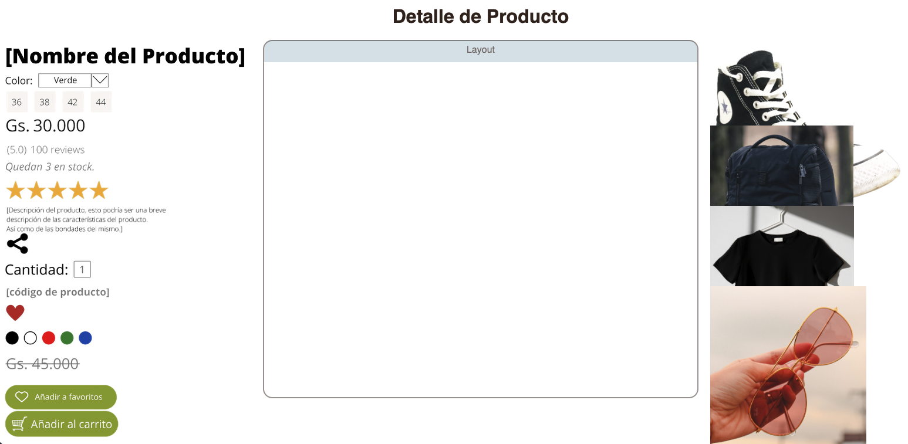

# Proyecto de Diseño Parte 2: Introducción a CSS

# Introducción:

CSS, o Cascading Style Sheets, resuelve un problema importante del desarrollo web: cómo hacer que tu sitio web se vea bien. Diseñar tus aplicaciones las hace más útiles y atractiva. También podés usar CSS para crear un diseño web receptivo (RWD), lo que permite que tus aplicaciones se vean bien sin importar en qué tamaño de pantalla se muestren. CSS no se trata solo de hacer que tu aplicación se vea bien; su especificación incluye animaciones y transformaciones que pueden permitir interacciones sofisticadas para tus aplicaciones. El grupo de trabajo CSS ayuda a mantener las especificaciones CSS actuales; podés seguir su trabajo en el [sitio del World Wide Web Consortium](https://www.w3.org/Style/CSS/members){:target="_blank"}.

> Tené en cuenta que CSS es un lenguaje que evoluciona, como todo en la web, y no todos los navegadores admiten partes más nuevas de la especificación. Siempre verificá tus implementaciones consultando [CanIUse.com](caniuse.com){:target="_blank"}.

En esta lección, agregaremos estilos a nuestro diseño de detalle de un producto en líneas y aprenderemos más sobre varios conceptos de CSS: la cascada, la herencia y el uso de selectores, posicionamiento y uso de CSS para crear diseños. En el proceso, diseñaremos el layout y crearemos la interfaz en sí.

## Requisito previo:

Deberías tener el HTML para tu diseño construido y listo para darle estilo.

# Tarea:

En tu carpeta de layout, creá un nuevo archivo llamado `style.css`. Importá ese archivo en la sección `<head>`:

```html
<link rel="stylesheet" href="./style.css" />
```

---

# 1. La cascada

Las hojas de estilo en cascada incorporan la idea de que los estilos 'se mueven en cascada' de manera que la aplicación de un estilo está guiada por su prioridad. Los estilos establecidos por el autor de un sitio web tienen prioridad sobre los establecidos por un navegador. Los estilos configurados 'en línea' tienen prioridad sobre los configurados en una hoja de estilo externa.

## Tarea:

Agregá el estilo en línea "color: red" a tu etiqueta `<h1>`:

```html
<h1 style="color: red">Detalle de Producto</h1>
```

Luego, agregá el siguiente código a tu archivo `style.css`:

```css
h1 {
  color: blue;
}
```

✅ ¿Qué color se muestra en tu aplicación web? ¿Por qué? ¿Podés encontrar una forma de anular estilos? ¿Cuándo querrías hacer esto o por qué no?

---

# 2. Herencia

Los estilos se heredan de un estilo antepasado a un estilo descendiente, de modo que los elementos anidados heredan los estilos de sus padres.

## Tarea:

Establecé la fuente del cuerpo en una fuente determinada y verificá para ver la fuente de un elemento anidado:

```css
body {
 font-family: helvetica, arial, sans-serif;
}
```

Abrí la consola de tu navegador en la pestaña 'Elementos' y observá la fuente H1. Hereda su fuente del cuerpo, como se indica en el navegador:

{: width="650" }{: .center-image}


✅ ¿Podés hacer que un estilo anidado herede una propiedad diferente?

---

# 3. Selectores CSS

## Etiquetas

Hasta ahora, tu archivo `style.css` tiene solo algunas etiquetas con estilo, y la aplicación se ve bastante extraña:

```css
body {
  font-family: helvetica, arial, sans-serif;
}

h1 {
  color: #3a241d;
  text-align: center;
}
```

Esta forma de diseñar una etiqueta te da control sobre elementos únicos, pero necesitás controlar los estilos de muchos elementos en tu layout. Para hacer eso, necesitás aprovechar los selectores de CSS.

## ID

Agregá un poco de estilo para diseñar los tableros izquierdo y derecho. Dado que solo hay un tablero izquierdo y solo un tablero derecho, se les dan identificadores en el marcado. Para diseñarlos, usá `#`:

```css
#tablero-izquierdo{
  width: 25%;
  position: absolute;
  height: 100%;
  padding: 10px;
  left: 0px;
}

#tablero-derecho {
  width: 25%;
  position: absolute;
  height: 100%;
  padding: 10px;
  right: 0px;
}
```

Aquí, colocaste estos tableros con posicionamiento absoluto en el extremo izquierdo y derecho de la pantalla, y utilizaste porcentajes para su ancho para que puedan escalar para pantallas móviles pequeñas.

✅ Este código se repite bastante, por lo tanto, no "DRY" (Don't Repeat yourself: No te repitas a vos mismo). ¿Podés encontrar una mejor manera de diseñar estos identificadores, tal vez con un ID y una clase? Necesitarías cambiar el marcado y refactorizar el CSS:

```html
<div id="tablero-izquierdo" class="tablero">
```

## Clases

En el ejemplo anterior, diseñaste dos elementos únicos en la pantalla. Si deseás que los estilos se apliquen a muchos elementos en la pantalla, podés usar clases CSS. Hacé esto para colocar los elementos en los tableros izquierdo y derecho.

Observá que cada elemento en el marcado HTML tiene una combinación de identificadores y clases. Los identificadores aquí son utilizados por JavaScript que agregarás más adelante para manipular la ubicación del elemento en el layout. Las clases, sin embargo, dan a todos los elementos un estilo determinado. Vamos a usar una clase para los componentes y otra para los productos.

```html
<div class="contenedor">
  
</div>

<div class="contenedor2">
  
</div>
```

Agregá lo siguiente a tu archivo `style.css`:

```css
.contenedor {
  position: relative;
  height: 6%;
 }

.contenedor2 {
  position: relative;
  height: 18%;
  left: -10px;
}

.reducido {
  height: 4%;
}

.componente {
  position: absolute;
  max-width: 100%;
  max-height: 150%;
  z-index: 3;
}

.producto {
  position: absolute;
  max-width: 200%;
  max-height: 200%;
  z-index: 2;
}
```

En este fragmento se destaca la mezcla de posicionamiento relativo y absoluto, que cubriremos en la siguiente sección. Echá un vistazo a la forma en que se manejan las alturas por porcentajes:

Además de las clases diferencias para componentes y productos vamos a usar otra más para los componentes que son pequeños, esto debido a que no todas las imágenes de componentes tienen el mismo tamaño, por lo que no se ve tan bien si a todos les ponemos el mismo alto (height).

La idea es que los elementos se muestren en ambas columnas sin necesidad de desplazarse, o al menos no mucho.

Para el componente en sí asignamos que tenga un ancho máximo del 100%, mientras que a	que para el producto en sí un ancho máximo de 200%. Esto permite que se reduzca a medida que el navegador se reduce. Intentá cambiar el tamaño de tu navegador; los elementos permanecen en sus contenedores pero se reducen para adaptarse.

También es notable el uso del índice z, que controla la altitud relativa de un elemento, para los componentes ponemos un índice superior al de los productos de manera que si los superponemos el componente se vea por encima del producto.

✅ ¿Por qué necesitás tanto un contenedor para elementos como un selector CSS de elementos?

# 4. Posicionamiento CSS

Mezclar propiedades de posición (hay posiciones estáticas, relativas, fijas, absolutas y pegajosas) puede ser un poco complicado, pero cuando se hace correctamente, te da un buen control sobre los elementos de tus páginas.

Los elementos de posición absoluta se colocan en relación con sus antepasados ​​colocados más cercanos y, si no hay ninguno, se colocan de acuerdo con el cuerpo del documento.

Los elementos de posición relativa se colocan según las direcciones del CSS para ajustar su ubicación lejos de su posición inicial.

En nuestra muestra, el "contenedor" es un elemento de posición relativa que se coloca dentro de un tablero de posición absoluta. El comportamiento resultante es que los tableros de las barras laterales se sujetan a izquierda y derecha, y el contenedor se encaja, ajustándose dentro de las barras laterales, dando espacio para que lo elementos se coloquen en una fila vertical.

> El `elemento` en sí también tiene un posicionamiento absoluto, necesario para que sea arrastrable, como descubrirás en la siguiente lección.

✅ Experimentá cambiando los tipos de colocación de los tableros laterales y el contenedor. ¿Qué pasa?

# 5. Diseños CSS

Ahora usarás lo que aprendiste para construir el layout en sí, ¡todo usando CSS!

Primero, diseñá los elementos secundarios `.layout` div como un rectángulo redondeado usando CSS:

```css
.layout {
  height: 80%;
  width: 45%;
  border: 2px solid #3a241d;
  border-radius: 1rem;
  position: absolute;
  opacity: 0.5;
  z-index: 1;
  margin: auto;
  left: 0px;
  right: 0px;
}

.rotulo {
  width: 45%;
  height: 5%;
  background: #C4D7E0;
  position: absolute;
  opacity: 0.7;
  z-index: 1;
  margin: auto;
  left: 0px;
  right: 0px;
  border-radius: 1em 1rem 0px 0px;
  text-align: center;
  color: #3a241d;
}

.titulo {
  position: relative;
  display: inline;
  top: 0.5rem;
}
```

Observá los porcentajes de ancho y alto de los elementos del layout y cómo cada elemento está absolutamente posicionado en el centro, esto se logra mediante la combinación de los siguientes elementos:

```css
margin: auto;
left: 0px;
right: 0px;
```

✅ Intentá cambiar los colores y la opacidad de tu html.

---


{: width="650" }{: .center-image}


# Revisión y autoestudio

CSS parece engañosamente sencillo, pero existen muchos desafíos cuando se trata de diseñar una aplicación perfectamente para todos los navegadores y todos los tamaños de pantalla. CSS-Grid y Flexbox son herramientas que se han desarrollado para hacer el trabajo un poco más estructurado y más confiable. Aprende sobre estas herramientas jugando a [Flexbox Froggy](https://flexboxfroggy.com/#es){:target="_blank"} y [Grid Garden](https://codepip.com/games/grid-garden/){:target="_blank"}.

Lectura adicional: [Diseñá tu aplicación HTML con CSS](https://docs.microsoft.com/es-mx/learn/modules/build-simple-website/4-css-basics?WT.mc_id=academic-13441-cxa){:target="_blank"}

## Tarea - Cambio de estilos

Para esta tarea, vamos a cambiar un poco los estilos que usamos en el proyecto. Podés cambiar los colores, bordes o tamaños de las cosas. Jugá con el diseño para personalizarlo un poco.

### Rúbrica

| Criterios | Ejemplar                                                         | Adecuada                      | Necesita mejorar                    |
| -------- | ----------------------------------------------------------------- | ----------------------------- | ------------------------------------ |
|          | Cambia el estilo de almenos 4 elementos | Modificó 2 o 3 elementos | No cambió el estilo del diseño en absoluto |
