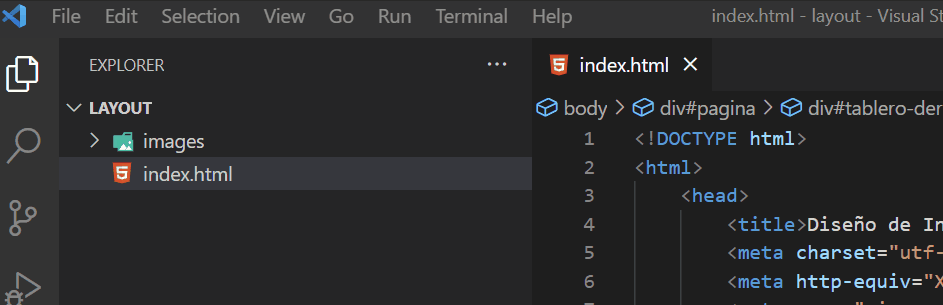
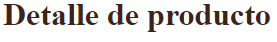
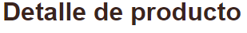

# Proyecto de Diseño Parte 2: Introducción a CSS
{: .no_toc }

<details open markdown="block">
  <summary>
    Table of contents
  </summary>
  {: .text-delta }
1. TOC
{:toc}
</details>

---

# Introducción:

{: .concept }
Las hojas de estilos en cascada (CSS) son un mecanismo simple para agregarle estilo (colores, espaciado, tipos de letra, etc.) a un Documento Web (otra forma de referirnos a un archivo html).

CSS, o Cascading Style Sheets, resuelve un problema importante del desarrollo web: cómo hacer que tu sitio web se vea bien. 
La apariencia de una pagina web es muy importante, ya que en gran medida esto es lo que la hace útil y fácil de usar. CSS no se trata solo de hacer que tu aplicación se vea bien; también nos deja hacer animaciones y transformaciones que pueden permitir interacciones sofisticadas para tus aplicaciones.

Una organizacion conocida como *El grupo de trabajo CSS* ayuda a mantener las especificaciones CSS actuales; podés seguir su trabajo en el [sitio del World Wide Web Consortium](https://www.w3.org/Style/CSS/members){:target="_blank"}.

En esta lección, agregaremos estilos a nuestra página para diseñar una tarjeta de producto y aprenderemos más sobre varios conceptos de CSS: la cascada, la herencia y el uso de selectores, posicionamiento y uso de CSS para estilizar una página.

## Requisito previo:

{: .important }
Deberías tener el archivo HTML del proyecto terminado y listo para darle estilo, fijate en el apartado "Introducción a HTML".

# La cascada

Las hojas de estilo en cascada incorporan la idea de que los estilos 'se mueven en cascada' de manera que la aplicación de un estilo está guiada por su prioridad. 
* Los estilos establecidos por el autor de un sitio web tienen prioridad sobre los establecidos por un navegador. 
* Los estilos configurados 'en línea' tienen prioridad sobre los configurados en una hoja de estilo externa.

### Actividad:
{: .no_toc }

Para entender mejor esto, empecemos por cambiar algún estilo en nuestra página web. En este caso, queremos que el título sea de color rojo, y no negro como está ahora.

Para hacer esto, ubiquemos el *encabezado* **Detalle de producto** en nuestro archivo HTML. El encabezado debe estar en la primera linea dentro de `<body>`, y debe estar en una etiqueta `<h1>`:

```html
<h1>Detalle de Producto</h1>
```

Las etiquetas `<h1>` se muestran de color negro en el navegador. Para cambiar el color, podemos agregar un **Atributo** a la etiqueta. Los atributos nos permiten modificar la apariencia o el comportamiento de los elementos, y siempre se se agregan en **la etiqueta de apertura**. Para cambiar el estilo (en este caso, solo el color), usamos el atributo `style`.

Modificá la linea donde se encuentra la etiqueta `<h1>`, para que quede así:

```html
<h1 style="color: red">Detalle de Producto</h1>
```

{: .concept }
Todos los elementos HTML pueden tener atributos que proveen información adicional sobre los elementos.
Los atributos siempre van en la etiqueta de apertura y tienen un nombre y un valor, que se escriben así: **nombre="valor"**

✅ Guardá los cambios en el HTML y fijate que pasa en la página web. Acordate de actualizar la página para ver los cambios!

Si hiciste todo bien, deberias haber notado que el color del encabezado cambió, y ahora es rojo. Lo que hacemos con el atributo `style`, es decirle al navegador que aplique el estilo indicado entre comillas, que está escrito en CSS.

De esta manera podemos seguir estilizando la página web cambiando colores y otras propiedades. Sinembargo, esto implica agregar atributos a todos los elementos del HTML, y esto resulta muy poco práctico y dificil de comprender cuando nuestro documento se hace más grande.

Para resolver este problema, usamos "Hojas de estilo externas". Se tratan de archivos en los que podemos escribir todos los estilos que queremos aplicar.

---

### Actividad:
{: .no_toc }

En Visual Studio, crea un archivo nuevo llamado `style.css` en la carpeta `Layout`



El archivo `style.css`, será el lugar donde vamos a especificar todos los estilos de nuestra página.

Pero, ahora que tenemos un archivo externo donde vamos a escribir los estilos, como sabe el navegador que debe mirar ahí?

Tenemos que decirle al navegador que siempre mire el archivo que creamos para saber que estilos aplicar, esto se hace en el HTML, en la cabecera del archivo (en la sección `<head>`).

Ubicá la cabecera del HTML y agregá ahí esta línea:

```html
<link rel="stylesheet" href="./style.css" />
```

La **etiqueta** `<link />` define la relación entre el archivo HTML y otros archivos. Con el **atributo** `rel`, le decimos que el archivo que queremos vincular es una hoja de estilos, y el **atributo** `href` le dice al navegador donde encontrar el archivo.

{: .important }
En el atributo `href`, el nombre del archivo debe coincidir con el nombre que le dimos cuando lo creamos. Si mas adelante no ves cambios en los estilos, asegurate de que los nombres coincidan.

La cabecera del archivo HTML debería quedar así:

```html
<head>
  <title>Diseño de Interfaces</title>
  <meta charset="utf-8" />
  <meta http-equiv="X-UA-Compatible" content="IE=edge" />
  <meta name="viewport" content="width=device-width, initial-scale=1" />
  <link rel="stylesheet" href="./style.css" />
</head>
```

Ahora que ya tenemos nuestra hoja de estilos externa creada y vinculada con el html, escribir nuestro primer estilo.

Agregá el siguiente código a tu archivo `style.css`:

```css
h1 {
  color: blue;
}
```

✅ ¿Qué color se muestra en tu aplicación web? ¿Por qué? (explicación mas abajo)

Si hiciste todo bien, no debería haber cambiado nada en la página.

Al escribir `h1{  }`, estamos diciendo que todos los estilos que escribamos entre las llaves `{}` se deben aplicar a todos los elementos `h1` en el HTML. En este caso, solo tenemos un elemento `h1`, al que en una actividad anterior le pusimos un estilo en línea para que sea rojo, directo en el HTML.

{: .concept }
`h1{  }` es un **SELECTOR** de etiquetas, porque selecciona todas las etiquetas `h1` del HTML para aplicarles los estilos correspondientes. Se puede usar para seleccionar cualquier etiqueta, por ejemplo: `div{  }`, o `h2{  }`

Ahora el navegador ve en nuestra hoja de estilos que estamos pidiendo que el color sea azul, así que el navegador tiene dos instrucciones contradictorias:

```css
/* EN EL CSS, DECIMOS QUE EL COLOR ES AZUL */
h1 {
  color: blue;
}
```

```html
<!-- EN EL HTML, DECIMOS QUE EL COLOR ES ROJO -->
<h1 style="color: red">Detalle de Producto</h1>
```

Como decide el navegador cual de los dos colores aplicar?

Lo hace siguiendo las reglas de la **cascada**, que dicen que siempre los estilos en linea tienen prioridad. Por eso el navegador sigue mostrando el color rojo, ignorando lo que escribimos en la hoja de estilos.

Si borramos el estilo en línea que aplicamos, el navegador tomará lo que encuentre en la hoja de estilos.

Probá dejando esta línea del HTML como estaba originalmente:

```html
<h1>Detalle de Producto</h1>
```
Si guardas todos los cambios y actualizas la página, deberías ver que el elemento h1 ahora es azul.

---

# Herencia

Ahora que tenemos la hoja de estilos preparada y ya entendemos como y donde escribir CSS, empecemos a ajustar los estilos de nuestra página.

### Actividad:
{: .no_toc }

En primer lugar, queremos cambiar la fuente del texto, esto es el tipo de letra de todo el texto en nuestra página. Para lograrlo, agregá el siguiente código el archivo CSS:

```css
body {
 font-family: helvetica, arial, sans-serif;
}
```
Guardá los cambios y actualizá la página web para ver que pasó.

Deberías haber notado un cambio en el tipo de letra.



Así queda ahora:



Logramos cambiar el tipo de letra utilizando la **propiedad** `font-family`.

Pero, anteriormente habiamos dicho que para cambiar el estilo de un elemento HTML, usabamos un selector de etiquetas para seleccionar las etiquetas que queriamos cambiar. Para cambiar una etiqueta `h1`, utilizamos el selector `h1 {  }`.

Entonces, por qué ahora utilizamos un selector `body {  }` para cambiar un elemento `h1`?

En HTML, decimos que los elementos pueden tener padres e hijos (antepasados y descendientes). Todos los elementos dentro de una etiqueta `body` son hijos de esa etiqueta.

De esta manera, si miramos nuestro HTML y vemos una estructura así:

```html
<body>
  <h1>Detalle de Producto</h1>
</body>
```

decimos que el elemento `h1` es un hijo del elemento `body`.

Lo que hicimos con el selector `body {  }` es definir un tipo de letra para el elemento `body`, y este todos los estilos que sean aplicados a este elemento serán **heredados** a sus hijos, en este caso, al elemento `h1`. Es por esta herencia que logramos que nuestro título cambie.

Hacemos esto de esta manera a que todo el texto que incluyamos en la página web tenga este tipo de letra, sin tener que aplicar estilos a todos los elementos de texto que queramos cambiar.

{: .concept }
En HTML, los elementos heredan los estilos de todos sus antepasados.

✅ Podés probar agregando otros elementos de texto para verificar cómo funciona la herencia, y te desafiamos a que hagas que otras propiedades sean heredadas (podes probar con la propiedad `color` que ya utilizamos).

---

# Selectores CSS

En CSS, los selectores son patrones o una sintaxis específica que nos permite *seleccionar* los elementos que queremos estilizar.

Nos permiten aplicar estilos elementos específicos. Hasta ahora, solo utilizamos los selectores de etiquetas.

## Selectores de Etiquetas

Hasta ahora, en el archivo `style.css` solo aplicamos estilos a dos elementos HTML: `<body>` y `<h1>`.

Los selectores de etiqueta o elementos nos permiten aplicar estilos a los elementos, buscando por sus etiquetas en el archivo HTML. Por ejemplo, cuando usamos el selector `h1 {  }`, estamos seleccionando **TODOS** los elementos de tipo `h1` en el HTML.

✅ Probá esto agregando otros elementos `h1` en el HTML. Todos deberían tener el mismo color. Luego podes agregar un elemento con otra etiqueta: `<h2>prueba<h2>`. Este no será afectado por los estilos en el selector `h1 {  }`.

### Actividad:
{: .no_toc }

Como tenemos un solo título en nuestra página, nos basta con usar ese selector para agregarle estilos. 

Necesitamos centrar el texto en la pantalla, y darle un color mas atractivo.

Por otro lado, podemos asignar el tipo de letra que queremos usar a la etiqueta `body`, para que todo el texto de la página sea igual.

Asegurate de que tu archivo CSS quede de la siguiente manera (puede que tengas que reemplazar cosas las pruebas que vinimos haciendo):

```css
body {
  font-family: helvetica, arial, sans-serif;
}

h1 {
  color: #3a241d;
  text-align: center;
}
```

✅ Cual es la propiedad que usamos para centrar el texto en la página?

---

Pareciera que con este tipo de selector podemos estilizar toda la página, pero el problema es que no podemos seleccionar un solo elemento específico, solo podemos seleccionar **todos** los `h1` o **todos** los `div`, y para continuar necesitamos aplicar estilos solo a un par de elementos de tipo `div`, pero no a los demás.

## Selectores de ID

Cuando en el HTML tenemos muchos elementos del mismo tipo (por ejemplo, muchos `div`) pero solo queremos modificar uno de ellos, podemos utilizar un selector de **ID**.

{: .concept }
En HTML, un ID es un nombre único que usamos para identificar un elemento. Este nombre no se puede repetir.

Si queremos aplicar un estilo a uno solo de los `div` que tenemos en nuestro HTML, necesitamos una forma de indivualizarlo, darle un nombre único. Este nombre único es el **ID**.

Para darle un ID, utilizamos el [atributo](#1-la-cascada) `id`.

{: .concept }
Recordemos que anteriormente usamos el atributo `style` para asignar estilos. El atributo `id` hace otra cosa, pero tiene la misma sintaxis.

Para asignar un identificador a un elemento escribimos el atributo de la siguiente manera, por ejemplo, en un `div`:

```html
<div id='nombre1'></div>
<div id='nombre2'></div>
<div id='nombre1'></div> <!-- NO PERMITIDO, el id 'nombre1' ya existe -->
```

{: .concept }
En el ejemplo vemos como se utiliza el id para nombrar elementos, pero es importante recordar que el id no puede repetirse.

### Actividad:
{: .no_toc }

En el archivo HTML, ya incluimos algunos elementos con identificadores. Estos elementos son los padres de las imagenes que queremos agrupar a la izquierda y a la derecha. Recordemos el diseño que queremos lograrar:


Para lograr esto, vamos a alinear el `div` con `id=tablero-izquierdo` a la izquierda, y el `div` con `id=tablero-derecho` a la derecha.

Copia el siguiente código en el archivo CSS, debajo de lo último que hicimos:

```css
#tablero-izquierdo{
  width: 25%;
  position: absolute;
  height: 100%;
  padding: 10px;
  left: 0px;
}

#tablero-derecho {
  width: 25%;
  position: absolute;
  height: 100%;
  padding: 10px;
  right: 0px;
}
```

✅ Tratá de identificar en el HTML cuales son los elementos que estamos modificando. Cambia los ids y verifica que todo funcione igual.

Utilizamos el selector de id escribiendo `#` seguido del nombre que le dimos al elemento, en este caso: `#tablero-izquierdo {  }`. Todos los estilos en ese selector, serán aplicados solo al `div` con ese ID.

Lo que hacemos con este código es lo siguiente 
* Utilizamos la propiedad `width` para fijar un ancho máximo para el div, en este caso de 25% de la pantalla.
* La propiedad `height` nos permite fijar una altura específica, en este caso queremos que ocule todo el alto de la pantalla.
* Finalmente, utilizamos las propuedades `right` y `left` para especificar los margenes derecho e izquierdo. Hacemos esto para que cada contenedor esté a un lado de la pantalla.

✅ Investigá para que usamos las otras propiedades.

Aquí, colocaste estos tableros con posicionamiento absoluto en el extremo izquierdo y derecho de la pantalla, y utilizaste porcentajes para su ancho para que puedan escalar para pantallas móviles pequeñas.

## Clases

Ya vimos como los selectores de etiqueta seleccionan todos los elementos con la misma etiqueta, y los selectores de ID seleccionan únicamente un elemento con el id especificado.

Ahora, que hacemos si necesitamos estilizar solo algunos de los `div`, pero no todos. Por ejemplo, en nuestra página usamos `div` para agrupar las imagenes que tienen que ir a la izquierda y a la derecha, pero también usamos multiples `div` para organizar el resto de la página.

Fijate en esta sección del HTML:

```html
<div class="contenedor">
  
</div>

<div class="contenedor">
  
</div>
```

Para cambiar el estilo de los elementos div que contienen a las imagenes, tenemos que utilizar un selector de clase, y para ello necesitamos agregar un atributo nuevo en el HTML.

Para usar los selectores de ID usamos el atributo `id`. Ahora necesitamos usar el atributo `class`, que ya incluimos cuando hicimos el HTML.

La clase es similar al id, pero en este caso se puede repetir. Esto significa que como vemos en el extracto de código de arriba, podemos tener muchos elementos que pertenecen a la misma clase.

{: .note }
Los `div` con clase contenedor son padres de los elementos `img` que muestran las imagenes. Hacemos esto para poder tener mas control sobre como queremos que las imagenes se vean e interactuen. Esto será importante en la clase de Javascript

Fijate que cada elemento en el HTML tiene una combinación de identificadores y clases. Los identificadores aquí son utilizados por el código JavaScript que agregarás más adelante para manipular la ubicación del elemento (para poder arrastrarlo). Las clases, sin embargo, dan a todos los elementos un estilo determinado.

En el documento HTML utilizamos varias clases para identificar distintos elementos.

✅ Si mirás el documento HTML, podes identificar todas las clases que utilizamos y a que tipo de elementos corresponden?. Por ejemplo, que clase tienen las imagenes de productos? y las imagenes de comonentes como el precio o la descripcion?

### Actividad:
{: .no_toc }

Para mejorar el estilo de nuestros elementos, agregá lo siguiente a tu archivo `style.css`:

```css
.contenedor {
  position: relative;
  height: 6%;
 }

.contenedor2 {
  position: relative;
  height: 18%;
  left: -10px;
}

.reducido {
  height: 4%;
}

.componente {
  position: absolute;
  max-width: 100%;
  max-height: 150%;
  z-index: 3;
}

.producto {
  position: absolute;
  max-width: 200%;
  max-height: 200%;
  z-index: 2;
}
```

{: .concept }
Para aplicar estilos a toda una clase, usamos un selector de clase, que lleva un punto `.` antes del nombre de la clase: `.componente {  }`. Esto aplicará los estilos correspondientes a todos los elementos de esa clase.

En este fragmento se destaca la mezcla de posicionamiento relativo y absoluto, que cubriremos en la siguiente sección. Echá un vistazo a la forma en que se manejan las alturas por porcentajes:

Además de las clases diferencias para componentes y productos vamos a usar otra más para los componentes que son pequeños, esto debido a que no todas las imágenes de componentes tienen el mismo tamaño, por lo que no se ve tan bien si a todos les ponemos el mismo alto (height).

La idea es que los elementos se muestren en ambas columnas sin necesidad de desplazarse verticalmente, o al menos no mucho.

Para el componente en sí definimos un ancho máximo del 100%, mientras que a	que para el producto el ancho máximo será 200%. Esto permite que en pantallas mas pequeñas las imagenes se hagan mas pequeñas. Intentá cambiar el tamaño de tu navegador; los elementos permanecen en sus contenedores pero se reducen para adaptarse.


También es notable el uso del índice z, que controla la altitud relativa de un elemento, para los componentes ponemos un índice superior al de los productos de manera que si los superponemos el componente se vea por encima del producto.

---

# Posicionamiento CSS

Mezclar propiedades de posición (hay posiciones estáticas, relativas, fijas, absolutas y pegajosas) puede ser un poco complicado, pero cuando se hace correctamente, te da un buen control sobre los elementos de tus páginas.

Los elementos de posición absoluta se colocan en relación con sus antepasados ​​colocados más cercanos y, si no hay ninguno, se colocan de acuerdo con el cuerpo del documento.

Los elementos de posición relativa se colocan según las direcciones del CSS para ajustar su ubicación lejos de su posición inicial.

En nuestra muestra, el "contenedor" es un elemento de posición relativa que se coloca dentro de un tablero de posición absoluta. El comportamiento resultante es que los tableros de las barras laterales se sujetan a izquierda y derecha, y el contenedor se encaja, ajustándose dentro de las barras laterales, dando espacio para que lo elementos se coloquen en una fila vertical.

> El `elemento` en sí también tiene un posicionamiento absoluto, necesario para que sea arrastrable, como descubrirás en la siguiente lección.

✅ Experimentá cambiando los tipos de colocación de los tableros laterales y el contenedor. ¿Qué pasa?

# Diseñando con CSS

Ahora usarás lo que aprendiste para construir tarjeta que va en el centro de la página, ¡todo usando CSS!

En la sección de Introducción a HTML habíamos agregado esta sección al HTML:

```html
<div id="layout">
  <div class="rotulo">
      <p class="titulo">Layout</p>
  </div>
  <div class="layout"></div>
</div>
```

Ahí tenemos tres clases nuevas:
* `class="layout"`: Este elemento será la tarjeta en sí, el espacio donde podremos arrastrar los elementos para diseñar nuestra anuncio del producto.
* `class="rotulo"`: Este `div` será un rótulo donde pondremos un titulo para nuestra tarjeta.
* `class="titulo"`: Este elemento nos permitirá editar los estilos del texto que pongamos en el rótulo, en este caso: Layout.
* `id="layout"`: En este caso usamos un id en lugar de una clase, y se trata del elemento que contiene toda la tarjeta.
  
### Actividad:
{: .no_toc }

Vamos a agregar algunos estilos para ir formando la tarjeta del centro, copiá el siguiente código en tu CSS:

```css
.layout {
  height: 80%;
  width: 45%;
  border: 2px solid #3a241d;
  border-radius: 1rem;
  position: absolute;
  opacity: 0.5;
  z-index: 1;
  margin: auto;
  left: 0px;
  right: 0px;
}

.rotulo {
  width: 45%;
  height: 5%;
  background: #C4D7E0;
  position: absolute;
  opacity: 0.7;
  z-index: 1;
  margin: auto;
  left: 0px;
  right: 0px;
  border-radius: 1em 1rem 0px 0px;
  text-align: center;
  color: #3a241d;
}

.titulo {
  position: relative;
  display: inline;
  top: 0.5rem;
}
```
✅ Jugá un poco con las distintas propiedades para ver que cosas cambian. Importante! cuando algo cambie identificá cual fue el elemento que cambió y porqué.

Observá los porcentajes de ancho y alto de los elementos del layout y cómo cada elemento está absolutamente posicionado en el centro, esto se logra mediante la combinación de los siguientes elementos:

```css
margin: auto;
left: 0px;
right: 0px;
```

✅ Intentá cambiar los colores y la opacidad de los elementos.

---

Terminamos! La página web debería haberte quedado mas o menos así:


