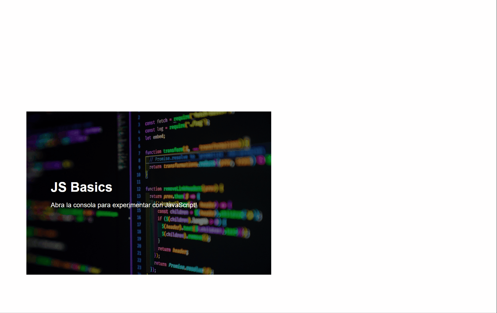

# Conceptos básicos de JavaScript: tipos de datos

Esta lección cubre los conceptos básicos de JavaScript, el lenguaje que proporciona interactividad en la web.

¡Comencemos con las variables y los tipos de datos que las pueblan!

# Preparar el proyecto

{: .important }
Para poder seguir este material paso a paso, podemos crear un nuevo proyecto con una pagina web en blanco, simplemente usar el proyecto que ya teniamos hecho.

### Actividad

Crea un proyecto nuevo así como lo hiciste en el apartado de [Intro a HTML](../3_html/Introduccion_HTML)

Recordemos los pasos:
1. Crea una carpeta llamada "js-basics"
2. Ya podés abrir la carpeta en el visual studio.
3. Agrega un archivo HTML llamado `index.html`.

Bastará con que nuestro HTML quede asi:

```html
<!DOCTYPE html>
<html>
    <head>
        <title>JS Basics</title>
        <meta charset="utf-8" />
        <meta http-equiv="X-UA-Compatible" content="IE=edge" />
        <meta name="viewport" content="width=device-width, initial-scale=1" />
        <script src="./script.js" defer></script>
    </head>
    <body>
        <h1>JS Basics<h1>
    </body>
</html>
```

No necesitamos incluir un archivo CSS para este proyecto, pero si querés, podes crear el archivo `style.css` y agregale todo lo que quieras a la página.

En el proyecto vamos a crear un archivo nuevo, llamado `script.js`, y vamos a agregar en la cabecera del HTML la siguiente linea:

```html
<script src="./script.js" defer></script>
```

Vamos a escribir todo nuestro código en JavaScript en el archivo `script.js`, y podemos empezar escribiendo un mensaje, que vamos a poder ver en la consola.

## Tarea - hola mundo en la consola

Escribí la siguiente linea en el archivo `script.js`.

```javascript
console.log("Hola Mundo");
```

Ahora abrí la pagina web del proyecto y abrí la consola, deberias poder ver el mensaje que escribiste.



---

# Variables

Las variables son objetos que almacenan valores en la computadora, para que podamos volver a usarlos mas tarde.

Podemos pensar que una variable es como una "caja" donde podemos meter cualquier valor, ya sea un numero, un texto, una imagen, etc.

Para crear o **declarar** una variable usamos la siguiente sintaxis **[keyword] [nombre]**, donde:

- **Keyword** es una palabra clave que le dice a la computadora que lo que estoy escribiendo es una nueva variable. Este keyword puede ser `let` o `var`.

    > Tené en cuenta que la palabra clave `let` se introdujo en ES6 y le da a tu variable un llamado _alcance de bloque_ (block scope). Se recomienda utilizar `let` sobre `var`. Cubriremos los alcances de bloque con más profundidad en partes futuras.

- **El nombre de la variable**, este es un nombre que vos mismo elegís, y que es equivalente a la etiqueta que pegamos en una caja para recordar que guardamos all.

## Tarea - trabajar con variables

1. **Declará una variable**. Declaremos una variable usando la palabra clave `let`:

    ```javascript
    let miVariable;
    ```

   `miVariable` ahora se ha declarado usando la palabra clave `let`. Actualmente no tiene ningún valor.

1. **Asignar un valor**. Almacená un valor en una variable con el operador `=`, seguido del valor esperado.

    ```javascript
    miVariable = 123;
    ```

   > Nota: el uso de `=` en esta lección significa que hacemos uso de un "operador de asignación", que se utiliza para establecer un valor en una variable. **No denota igualdad**.

    `miVariable` ahora se ha *inicializado* con el valor 123.

1. **Refactorizar código**. Reemplazá tu código con la siguiente declaración.

    ```javascript
    let miVariable = 123;
    ```

    Lo anterior se denomina _inicialización explícita_ cuando se declara una variable y se le asigna un valor al mismo tiempo.

1. **Cambiar el valor de la variable**. Cambiá el valor de la variable de la siguiente manera:


   ```javascript
   miVariable = 321;
   ```

   Una vez que se declara una variable, podés cambiar su valor en cualquier punto de tu código con el operador `=` y el nuevo valor.

    ✅ ¡Probá! Podés escribir JavaScript directamente en tu navegador. Abrí una ventana del navegador y navegá hasta Herramientas de desarrollo. En la consola, encontrarás un mensaje; escribí `let miVariable = 123`, presioná retorno (enter), luego escribí `miVariable`. ¿Qué pasa? Tené en cuenta que aprenderás más sobre estos conceptos en lecciones posteriores.

---

# Constantes

La declaración e inicialización de una constante sigue los mismos conceptos que una variable, con la excepción de la palabra clave `const`. Las constantes se declaran normalmente con todas las letras mayúsculas, esto es lo que se llama una *convención de nombre*.

```javascript
const MY_VARIABLE = 123;
```

Las constantes son similares a las variables, con dos excepciones:

- **Deben tener un valor**. Las constantes deben inicializarse o se producirá un error al ejecutar el código.
- **El valor en constantes simples no se puede cambiar**. El valor de una constante no se puede cambiar una vez inicializada, o se producirá un error al ejecutar el código. Veamos un ejemplo:
    - **Valor simple**. NO se permite lo siguiente:
      ```javascript
      const PI = 3;
      PI = 4; // no permitido
      ```

   > Tené en cuenta que `const` significa que la referencia está protegida contra la reasignación. Sin embargo, algunas estructuras complejas que pueden declararse como costantes permiten que se cambie alguno de sus valores.

---

# Tipos de datos

Las variables pueden almacenar muchos tipos diferentes de valores, como números y texto. Estos diversos tipos de valores se conocen como **tipos de datos**. Los tipos de datos son una parte importante del desarrollo de software porque ayudan a los desarrolladores a tomar decisiones sobre cómo se debe escribir el código y cómo se debe ejecutar el software. Además, algunos tipos de datos tienen características únicas que ayudan a transformar o extraer información adicional en un valor.

✅ Los tipos de datos también se conocen como primitivas de datos de JavaScript, ya que son los tipos de datos de nivel más bajo que proporciona el lenguaje. Hay 6 tipos de datos primitivos: cadena, número, bigint, booleano, indefinido y símbolo. Tomate un minuto para visualizar lo que podría representar cada una de estas primitivas. ¿Qué es una `cebra`? ¿Qué tal `0`? ¿`true`?

## Números

En la sección anterior, el valor de "miVariable" era un tipo de dato numérico.

`let miVariable = 123;`

Las variables pueden almacenar todo tipo de números, incluidos decimales o números negativos. Los números también se pueden usar con operadores aritméticos, que se tratan en la [siguiente sección](#operadores-aritméticos).

## Operadores aritméticos

Hay varios tipos de operadores que se pueden utilizar al realizar funciones aritméticas, y algunos se enumeran aquí:

| Símbolo | Descripción                                                           | Ejemplo                                |
| ------- | --------------------------------------------------------------------- | -------------------------------------- |
| `+`     | **Suma**: Calcula la suma de dos números                              | `1 + 2 //la respuesta esperada es 3`   |
| `-`     | **Resta**: Calcula la diferencia de dos números                       | `1 - 2 //la respuesta esperada es -1`  |
| `*`     | **Multiplicación**: Calcula el producto de dos números                | `1 * 2 //la respuesta esperada es 2`   |
| `/`     | **División**: Calcula el cociente de dos números                      | `1 / 2 //la respuesta esperada es 0.5` |
| `%`     | **Restante**: Calcula el resto a partir de la división de dos números | `1 % 2 //la respuesta esperada es 1`   |

✅ Probá una operación aritmética en la consola de tu navegador. ¿Te sorprenden los resultados?

## String

Las cadenas (Strings) son conjuntos de caracteres que residen entre comillas simples o dobles.

- `'Esto es un String'`
- `"Esto también es un String"`
- `let miCadena = 'Este es un valor del String almacenado en una variable';`

Recordá utilizar comillas al escribir un String, de lo contrario JavaScript asumirá que es un nombre de variable.

## Formateo de Strings

Los Strings son textuales y requerirán formato de vez en cuando.

Para **concatenar** dos o más Strings, o unirlas, usá el operador `+`.

```javascript
let miCadena1 = "Hola";
let miCadena2 = "Mundo";

miCadena1 + miCadena2 + "!"; //¡Hola, mundo!
miCadena1 + " " + miCadena2 + "!"; //¡Hola, mundo!
miCadena1 + ", " + miCadena2 + "!"; //¡Hola, mundo!

```

✅ ¿Por qué `1 + 1 = 2` en JavaScript, pero `'1' + '1' = 11?` Pensá en ello. ¿Qué pasa con `'1' + 1`?

**Los literales de plantilla** son otra forma de formatear Strings, excepto que en lugar de comillas, se usa la comilla invertida. Todo lo que no sea texto sin formato debe colocarse dentro de los marcadores de posición `${ }`. Esto incluye cualquier variable que pueda ser Strings.


```javascript
let miCadena1 = "Hola";
let miCadena2 = "Mundo";

`${miCadena1} ${miCadena2}!` //¡Hola, mundo!
`${miCadena1}, ${miCadena2}!` //¡Hola, mundo!
```

Podés lograr tus objetivos de formato con cualquier método, pero los literales de plantilla respetarán los espacios y saltos de línea.

✅ ¿Cuándo usarías una plantilla literal frente a un String simple?

## Booleanos

Los booleanos pueden tener solo dos valores: `true` (verdadero) o `false` (falso). Los valores booleanos pueden ayudar a tomar decisiones sobre qué líneas de código deben ejecutarse cuando se cumplen ciertas condiciones. En muchos casos, [operadores](#operadores-aritméticos) ayudan a establecer el valor de un booleano y, a menudo, notarás y escribirás variables que se inicializan o que sus valores se actualizan con un operador.

- `let mTrueBool = true`
- `let mFalseBool = false`

✅ Una variable se puede considerar 'verdadera' si se evalúa como un valor booleano 'verdadero'. Curiosamente, en JavaScript, [todos los valores son verdaderos a menos que se definan como falsos](https://developer.mozilla.org/es/docs/Glossary/Truthy){:target="_blank"}.

🚀 Desafío: JavaScript es conocido por sus sorprendentes formas de manejar tipos de datos en ocasiones. Investigá un poco sobre estos "errores". Por ejemplo: ¡la sensibilidad a mayúsculas y minúsculas puede morder! Probá esto en tu consola: 
`let age = 1; let Age = 2; age == Age` 
(resuelve `false` - ¿por qué?). ¿Qué otras trampas podés encontrar?

---

# Revisión y autoestudio

Echá un vistazo a [esta lista de ejercicios de JavaScript](https://css-tricks.com/snippets/javascript/){:target="_blank"} y probá uno. ¿Qué aprendiste?

## Tarea - Práctica de tipos de datos

### Instrucciones

Imaginá que estás construyendo un carrito de compras para una página web. Describí los tipos de datos que necesitarías para completar tu experiencia de compra, explicando que variables utilizarías y de que tipo serían. ¿Cómo llegaste a tus elecciones?

### Rúbrica

Criterios | Ejemplar | Adecuado | Necesita mejorar
--- | --- | --- | - |
| Se explican todas variables necesarias para el carrito, incluyendo una descripción de para que está cada una | Se explican algunas variables, pero no todas las necesarias para el funcionamiento básico | Se explora solo una variable, o no completa el ejercicio |
 
