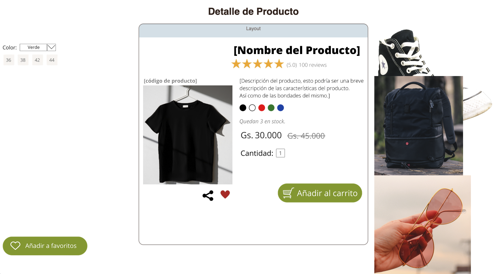

# Proyecto de Diseño Parte 3: Introducción a Manipulación del DOM y Closure

Es hora de retomar nuestro proyecto de diseño para mientras continuamos avanzando en la introducción a JavaScript.

# Introducción:

Manipular el DOM, o el "Modelo de objetos de documento", es un aspecto clave del desarrollo web. Según [MDN](https://developer.mozilla.org/es/docs/Web/API/Document_Object_Model/Introduction){:target="_blank"}, "El modelo de objetos de documento (DOM) es la representación de datos de los objetos que componen la estructura y contenido de un documento en la web ". Los desafíos en torno a la manipulación del DOM en la web a menudo han sido el ímpetu detrás del uso de marcos de JavaScript en lugar de JavaScript vanilla para administrar el DOM, ¡pero lo administraremos por nuestra cuenta!

Además, esta lección presentará la idea de un [closure de JavaScript](https://developer.mozilla.org/es/docs/Web/JavaScript/Closures){:target="_blank"}, que podés considerar como una función encerrada por otra función para que la función interna tenga acceso al alcance de la función externa.

Usaremos un closure para manipular el DOM.

> Pensá en el DOM como un árbol, que representa todas las formas en que se puede manipular un documento de página web. Se han escrito varias API (interfaces de programas de aplicación) para que los programadores, utilizando el lenguaje de programación de su elección, puedan acceder al DOM y editarlo, cambiarlo, reorganizarlo y administrarlo de otro modo.

{: width="650" }{: .center-image}


En esta lección, completaremos nuestro proyecto de diseño interactivo creando el JavaScript que permitirá al usuario manipular los elementos en la página.

## Requisito previo:

Deberías tener el HTML y CSS para tu layout construido. Al final de esta lección, podrás mover los elementos dentro y fuera del layout arrastrándolos.

# Tarea:

En tu carpeta de layout, creá un nuevo archivo llamado `script.js`. Importá ese archivo en la sección `<head>`:

```html
	<script src="./script.js" defer></script>
```

> Nota: usá `defer` cuando importes un archivo JavaScript externo en el archivo html para permitir que el JavaScript se ejecute sólo después de que el archivo HTML se haya cargado por completo. También podría usar el atributo `async`, que permite que el script se ejecute mientras se analiza el archivo HTML, pero en nuestro caso, es importante tener los elementos HTML completamente disponibles para arrastrar antes de permitir que se ejecute el script de arrastre.

---

# 1. Los elementos DOM

Lo primero que debé hacer es crear referencias a los elementos que deseás manipular en el DOM. En nuestro caso, son los componentes y productos que esperan actualmente en las barras laterales.


## Tarea:

```html
arrastrarElemento(document.getElementById('componente1'));
arrastrarElemento(document.getElementById('componente2'));
arrastrarElemento(document.getElementById('componente3'));
arrastrarElemento(document.getElementById('componente4'));
arrastrarElemento(document.getElementById('componente5'));
arrastrarElemento(document.getElementById('componente6'));
arrastrarElemento(document.getElementById('componente7'));
arrastrarElemento(document.getElementById('componente8'));
arrastrarElemento(document.getElementById('componente9'));
arrastrarElemento(document.getElementById('componente10'));
arrastrarElemento(document.getElementById('componente11'));
arrastrarElemento(document.getElementById('componente12'));
arrastrarElemento(document.getElementById('componente13'));
arrastrarElemento(document.getElementById('componente14'));
arrastrarElemento(document.getElementById('componente15'));
arrastrarElemento(document.getElementById('componente16'));
arrastrarElemento(document.getElementById('producto1'));
arrastrarElemento(document.getElementById('producto2'));
arrastrarElemento(document.getElementById('producto3'));
arrastrarElemento(document.getElementById('producto4'));
```

¿Que está pasando acá? Está haciendo referencia al documento y mirando a través de su DOM para encontrar un elemento con un Id particular. ¿Recordás en la primera lección sobre HTML que le diste ID individuales a cada imagen (`id = "componente1"`)? Ahora vas a hacer uso de ese esfuerzo. Después de identificar cada elemento, pasá ese elemento a una función llamada `arrastrarElemento` que creará en un minuto. Por lo tanto, el elemento en el HTML ahora está habilitado para arrastrar, o lo estará en breve.

✅ ¿Por qué hacemos referencia a elementos por Id? ¿Por qué no por su clase de CSS? Podés consultar la lección anterior sobre CSS para responder a esta pregunta.

---

# 2. El closure

Ahora estás listo para crear el closure `arrastrarElemento`, que es una función externa que encierra una función o funciones internas (en nuestro caso, tendremos tres).

Los closures son útiles cuando una o más funciones necesitan acceder al alcance de una función externa. He aquí un ejemplo:

```javascript
function mostrarCaramelo(){
 let caramelo = ['jellybeans];
 function agregarCaramelo(tipoCaramelo) {
  caramelo.push(tipoCaramelo)
 }
 agregarCaramelo('gumdrops');
}
mostrarCaramelo();
console.log(caramelo)
```

En este ejemplo, la función `mostrarCaramelo` rodea una función que inserta un nuevo tipo de caramelo en un vector que ya existe en la función. Si tuvieras que ejecutar este código, el vector `caramelo` no estaría definido, ya que es una variable local (local al closure).

✅ ¿Cómo se puede hacer accesible el vector `caramelo`? Intentá moverlo fuera del closure. De esta manera, el vector se vuelve global, en lugar de permanecer solo disponible para el alcance local del closure.

## Tarea:

Debajo de las declaraciones de elementos en `script.js`, creá una función:

```javascript
function arrastrarElemento(element) {
 //establecer 4 posiciones para posicionar en la pantalla
 let pos1 = 0,
  pos2 = 0,
  pos3 = 0,
  pos4 = 0;
 element.onpointerdown = arrastrarPuntero;
}
```

`arrastrarElemento` obtiene su objeto `element` de las declaraciones en la parte superior del script. Luego, establece algunas posiciones locales en "0" para el objeto pasado a la función. Estas son las variables locales que se manipularán para cada elemento a medida que agregás la funcionalidad de arrastrar y soltar dentro del closure de cada elemento. El layout estará poblado por estos elementos arrastrados, por lo que la aplicación debe realizar un seguimiento de dónde se colocan.

Además, al `element` que se pasa a esta función se le asigna un evento `pointerdown`, que forma parte de las [API web](https://developer.mozilla.org/es/docs/Web/API){:target="_blank"} diseñadas para ayudar con la gestión del DOM. `Onpointerdown` se dispara cuando se presiona un botón, o en nuestro caso, se toca un elemento que se puede arrastrar. Este controlador de eventos funciona tanto en [navegadores web como móviles](https://caniuse.com/?search=pointerdown){:target="_blank"}, con algunas excepciones.

✅ El [controlador de eventos `onclick`](https://developer.mozilla.org/es/docs/conflicting/Web/API/Element/click_event){:target="_blank"} tiene mucho más soporte entre navegadores; ¿Por qué no lo usarías acá? Pensá en el tipo exacto de interacción de pantalla que estás intentando crear acá.

---

# 3. La función arrastrarPuntero

El element está listo para ser arrastrado; cuando se dispara el evento `onpointerdown`, se invoca la función `arrastrarPuntero`. Agregá esa función justo debajo de esta línea: `element.onpointerdown = arrastrarPuntero;`:

## Tarea: 

```javascript
function arrastrarPuntero(e) {
 e.preventDefault();
 console.log(e);
 pos3 = e.clientX;
 pos4 = e.clientY;
}
```

Suceden varias cosas. Primero, evita que ocurran los eventos predeterminados que normalmente ocurren en el puntero hacia abajo usando `e.preventDefault ();`. De esta manera, tenés más control sobre el comportamiento de la interfaz.

> Regresá a esta línea cuando hayas construido el archivo de script por completo y pruébelo sin `e.preventDefault ()`- ¿qué sucede?

En segundo lugar, abrí `index.html` en una ventana del navegador e inspeccioná la interfaz. Cuando hacés clic en un elemento, podés ver cómo se captura el evento 'e'. ¡Profundizá en el evento para ver cuánta información recopila un evento de puntero hacia abajo!

A continuación, observá cómo las variables locales `pos3` y` pos4` se establecen en `e.clientX`. Podés encontrar los valores de `e` en el panel de inspección. Estos valores capturan las coordenadas x e y del elemento en el momento en que hacés clic en él o lo tocás. Necesitarás un control detallado sobre el comportamiento de los elementos al hacer clic en ellos y arrastrarlos, de modo que puedas realizar un seguimiento de sus coordenadas.

✅ ¿Está cada vez más claro por qué toda esta aplicación está construida con un gran closure? Si no fuera así, ¿cómo mantendrías el alcance para cada una de los elementos arrastrables?

Completá la función inicial agregando dos manipulaciones de eventos de puntero más en `pos4 = e.clientY`:

```html
document.onpointermove = iniciarArrastreElemento;
document.onpointerup = pararArrastreElemento;
```

Ahora estás indicando que deseás que el elemento se arrastre junto con el puntero mientras lo movés, y que el gesto de arrastre se detenga cuando anulás la selección del elemento. `onpointermove` y `onpointerup` son partes de la misma API que `onpointerdown`. La interfaz arrojará errores ahora ya que aún no definiste las funciones `iniciarArrastreElemento` y `pararArrastreElemento`.

# 4. Las funciones iniciarArrastreElemento y pararArrastreElemento

Completarás tu closure agregando dos funciones internas más que se encargarán de lo que sucede cuando arrastrás un elemento y dejás de arrastrarlo. El comportamiento que deseás es que puedas arrastrar cualquier elemento en cualquier momento y colocarlo en cualquier lugar de la pantalla. Esta interfaz no tiene opiniones (no hay zona de caída, por ejemplo) para permitirte diseñar tu layout exactamente como quieras agregando, quitando y reposicionando elementos.

## Tarea:

Agregá la función `iniciarArrastreElemento` justo después del corchete de closure de `arrastrarPuntero`:

```javascript
function iniciarArrastreElemento(e) {
 pos1 = pos3 - e.clientX;
 pos2 = pos4 - e.clientY;
 pos3 = e.clientX;
 pos4 = e.clientY;
 console.log(pos1, pos2, pos3, pos4);
 element.style.top = element.offsetTop - pos2 + 'px';
 element.style.left = element.offsetLeft - pos1 + 'px';
}
```

En esta función editás mucho las posiciones iniciales 1-4 que estableciste como variables locales en la función externa. ¿Que está pasando acá?

A medida que arrastrás, reasignás `pos1` haciéndolo igual a `pos3` (que configuraste anteriormente como `e.clientX`) menos el valor actual de `e.clientX`. Realizás una operación similar a `pos2`. Luego, restablecés `pos3` y `pos4` a las nuevas coordenadas X e Y del elemento. Podés ver estos cambios en la consola mientras arrastrás. Luego, manipulás el estilo CSS del elemento para establecer su nueva posición en función de las nuevas posiciones de `pos1` y `pos2`, calculando las coordenadas X e Y superior e izquierda del elemento en función de la comparación de su desplazamiento con estas nuevas posiciones.

> `OffsetTop` y `offsetLeft` son propiedades CSS que establecen la posición de un elemento basándose en la de su padre; su padre puede ser cualquier elemento que no esté posicionado como "estático".

Todo este recálculo de posicionamiento te permite afinar el comportamiento del layout y sus elementos.

## Tarea:

La tarea final para completar la interfaz es agregar la función `pararArrastreElemento` después del corchete de closure de `iniciarArrastreElemento`:

```javascript
function pararArrastreElemento() {
 document.onpointerup = null;
 document.onpointermove = null;
}
```

Esta pequeña función restablece los eventos `onpointerup` y `onpointermove` para que puedas reiniciar el progreso de tu elemento comenzando a arrastrarlo nuevamente, o comenzar a arrastrar un nuevo elemento.

✅ ¿Qué sucede si no configurás estos eventos como nulos?

¡Ahora completaste tu proyecto!

---

🥇¡Felicitaciones! Terminaste tu interfaz. 
{: width="650" }{: .center-image}


🚀 Desafío: agregá un nuevo controlador de eventos a tu closure para hacer algo más en los elementos; por ejemplo, hacer doble clic en un elementos para traerla=o al frente. ¡Sé creativo!


# Revisión y autoestudio

Si bien arrastrar elementos por la pantalla parece trivial, hay muchas formas de hacerlo y muchas trampas, según el efecto que busques. De hecho, hay una [API de arrastrar y soltar](https://developer.mozilla.org/es/docs/Web/API/HTML_Drag_and_Drop_API){:target="_blank"} completa que podés probar. No lo usamos en este módulo porque el efecto que queríamos era algo diferente, pero probá esta API en tu propio proyecto y ve lo que podés lograr.


