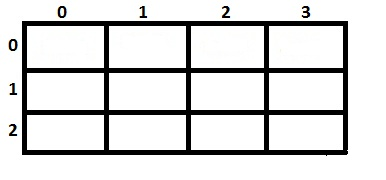
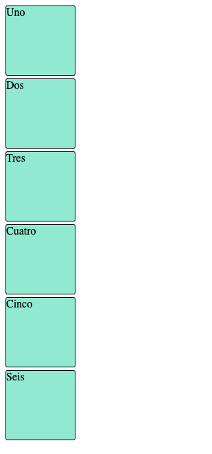
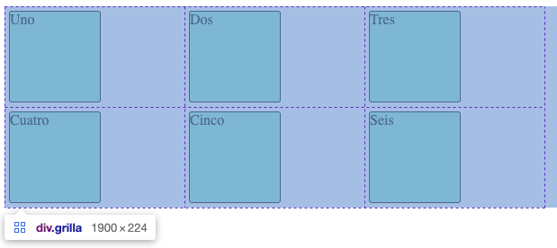
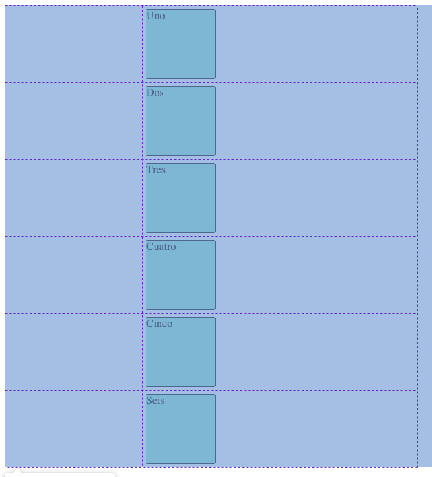
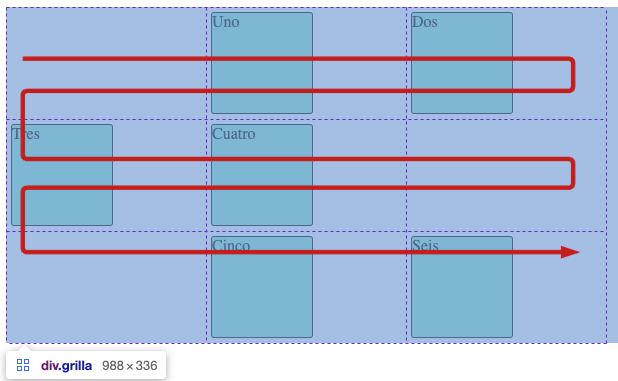

# Grilla o Matriz

En esta sección vamos a introducir un nuevo concepto que es el de creación de grillas mediante CSS.
Una grilla, también llamada matriz, es una colección de líneas horizontales (filas) y líneas verticales (columnas).

Hasta ahora hemos visto lo que es un array o vector, el cual se trata de una estructura unidimencional. Una grilla se trata de una estructura bidimencional; es decir, tiene dos dimensiones.



# Grilla en CSS

CSS noss provee de 2 módulos que contienen todas las funciones necesarias para armar grillas, que son [CSS Grid Layout](https://developer.mozilla.org/es/docs/Web/CSS/CSS_Grid_Layout){:target="_blank"} y [CSS Flexbox](https://developer.mozilla.org/es/docs/Web/CSS/CSS_Flexible_Box_Layout){:target="_blank"}.

Nosotros vamos a ver CSS Grid Layout. Como siempre, te instamos a que no te limites a la información proveída acá, sino que investigues por tu cuenta y veas cuál módulo te sienta mejor.

# CSS Grid Layout

CSS Grid Layout es un sistema de diseño bidimensional basado en cuadrículas que, en comparación con cualquier sistema de diseño web del pasado, cambia por completo la forma en que diseñamos las interfaces de usuario. Una **interfaz de usuario** es el medio por el cual el usuario interactúa con nuestra página web, aplicación, etc. Por ejemplo, el layout que definimos en clases pasadas es una interfaz de usuario.

Veamos ahora cómo funcion Grid Layout. 

## Propiedad para el nodo padre

Para el nodo padre es necesari definir el atributo `display`. Al utilizar Grid Layout este atributo puede tener dos valores: `grid` o `inline-grid`. Nosotros vamos a utiilzar `grid`.

> Esta es una introducción bastante sencilla a Grid Layout, por lo que te sugerimos que siempre revises la documentación oficial como texto de apoyo.

Probemos con un ejemplo. Si por ejemplo tenemos seis elementos que queremos posicionar en una grilla haríamos lo siguiente. Primero crearíamos nuestro archivo HTML y dento lo siguiente:

```html
<!DOCTYPE html>
<html>
<head>
</head>
<body>
  <div class="grilla">
    <div class="elemento">Uno</div>
    <div class="elemento">Dos</div>
    <div class="elemento">Tres</div>
    <div class="elemento">Cuatro</div>
    <div class="elemento">Cinco</div>
    <div class="elemento">Seis</div>
  </div>
</body>
</html>
```

Hasta ahora siempre vimos que el CSS va en un archivo a parte, es posible también incluir CSS directo en el tag `style` del header de nuestro HTML. Utilizaremos esta aproximación ya que nuestro HTML es pequeño y sencillo.

```html
<style>
  .grilla {
    display: grid;
  }
  .elemento {
    background-color: #6FEDD6;
    border: 1px #000 solid;
    border-radius: 3px;
    margin: 5px;
  }
</style>
```

Si abrimos este html vemos que los elementos se ven uno debajo del otro. Esto se da porque nosotros no le definimos a grid la distribución de los elementos que queremos, entonces este es su comportamiento por defecto.



## Distribución de ítems

Para definir cómo se hará la distribución de los elementos dentro de la grilla, Grid Layout dispone de dos propiedades: `grid-template-columns` y `grid-template-rows`. Estos atributos definen las columnas y filas de la cuadrícula con una lista de valores separados por espacios. Por ejemplo, si queremos que los elementos de nuestro HTML de prueba se distribuyan en tres columnas con un ancho específico definiríamos de la siguiente manera.

```css
.grilla {
  display: grid;
  grid-template-columns: 200px 200px 200px;
}
```

Ahora vemos que efectivamente los elementos se pusieron en filas y columnas. Al inspeccionar nuestro HTML en el navegador podemos el límite de cada contenedor de nuestros elementos, formado por las filas y columnas.



✅ Si cambiás el atributo por `grid-template-rows` pero manteniendo su valor, ¿qué pasa?, ¿podés deducir por qué se ve de esa manera?. Ojo, hay una relación entre la cantidad de atributos y las columnas.

Podríamos hablar todo el bootcamp de las bondades de Grid Layout, pero no es esa la idea. Para cerrar esta sección vamos a hablar de algo que en realidad no vamos a usar dentro de nuestro juego de memoria pero que consideramos importante conocer.

## Ubicación específica de elementos

Hasta ahora vimos que Grid Layout se encarga de ubicar los elementos en cada uno de los lugares de la grilla. Sin embargo, también nos da la posibilidad de especificar una columna o fila específica para cada elemento.

Por ejemplo, supongamos que deseamos que los seis elementos de nuestro HTML se ubiquen todos en la segunda columna. Para ello definimos el atributo `grid-column` indicando el número de la columna en la que queremos ubicar el elemento.

```css
.elemento {
  ...
  grid-column: 2;
}
```

Si volvés a cargar tu .html vas a ver que ahora todos los elementos se ubicaron en la segunda columna.



Si por otro lado, queremos que sólo algunos elementos se coloquen exclusivamente en la columna 2 en todo momento podríamos hacer lo siguiente, para este caso vamos a usar el css dentro del tag HTML.

Primero borrar el `grid-column: 2;` de la clase `elemento` y luego modifcar nuestro HTML como sigue:

```html
<div class="grilla">
  <div style="grid-column: 2;" class="elemento">Uno</div>
  <div class="elemento">Dos</div>
  <div class="elemento">Tres</div>
  <div class="elemento">Cuatro</div>
  <div style="grid-column: 2;" class="elemento">Cinco</div>
  <div class="elemento">Seis</div>
</div>
```

Podemos ver que Grid Layout respeta la especificación de columna que definimospara algunos elementos mientras que loss siguee ubicando en la grilla. Se puede ver que efectivamente hay un orden para la ubicación y se forma un "flujo" de los elementos.




# Revisión y autoestudio

Grid Layout junto con Flexbox cambiaron la manera de distribuir los elementos dentro de las páginas HTML. [Leé sobre el resto de atributos](https://developer.mozilla.org/es/docs/Web/CSS/CSS_Grid_Layout/Basic_Concepts_of_Grid_Layout){:target="_blank"} que Grid Layout nos provee para la manipulación de los elementos.


## Tarea - Unidades de medida en CSS

### Instrucciones

Grid Layout introdujo una nueva unidad de medida para ser utilizada en `grid-template-*`. Investigá cuál es esta unidad y comparala con las demás ya existentes.

### Rúbrica

| Criterios | Ejemplar | Adecuado | Necesita mejorar |
| -------- | --------------------------------------- | ------------------------ | ------------------------------ |
| | Se hace una comparación entre las distintas unidades de medida y la nueva | Se lista la nueva unidad de medida | No se lista la nueva unidad de medida |
