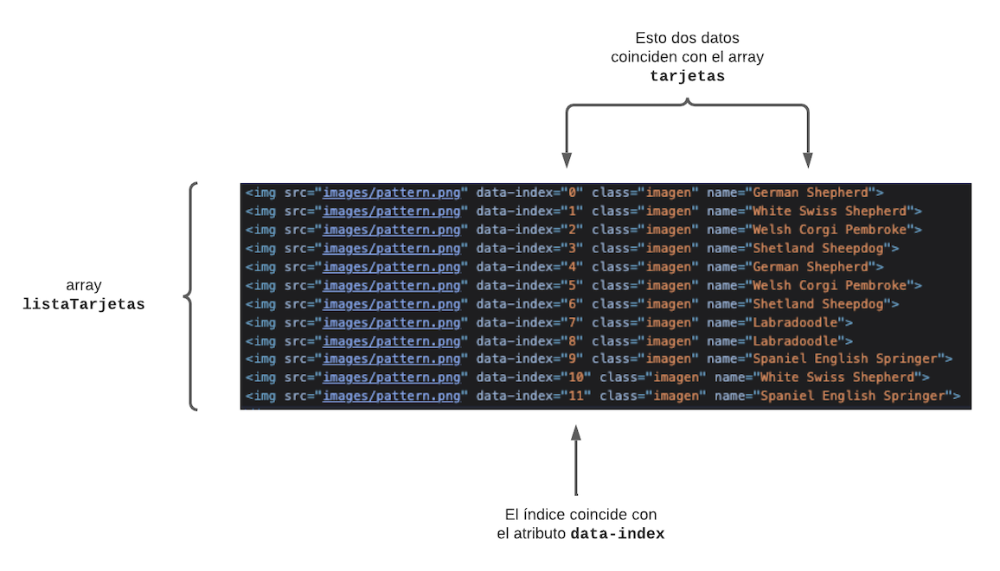
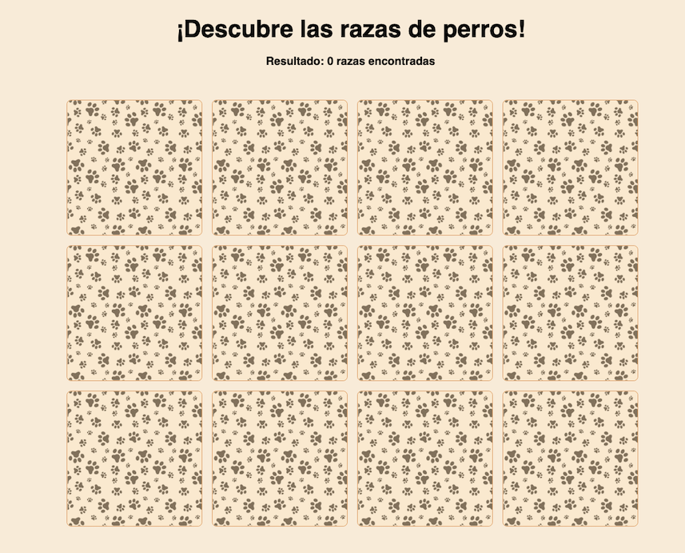

# Memorama

También llamado Juego de Memoria, consiste en ir descubriendo pares de elementos iguales que se encuentran escondidos. En cada tirada se destapan dos elementos que se vuelven a esconder si no coinciden. El objetivo es descubrir todas las parejas. Este juego puede ser jugado contra un rival, o a contratiempo. Nosotros lo vamos a hacer sencillo, vamos a utilizar diversas razas de perros para nuestro proyecto de ejemplo.

---

# Nuestros Archivos

Para ello como siempre vamos a crear una carpeta y tener en ella nuestros 3 archivos, tal y como lo venimos haciendo desde el inicio.

  - index.html
  - script.js
  - style.css

---

# HTML Base

Vamos a utilizar los conceptos vistos en las secciones anteriores de esta clase, por lo que nuestro HTML va a ser sumamente sencillo.

```html
<!DOCTYPE html>
<html lang="en" dir="ltr">
  <head>
      <meta charset="utf-8">
      <title>Memorana</title>
      <script src="script.js"></script>
      <link rel="stylesheet" href="style.css">
  </head>
  <body>
    <div>
      <h1 class="titulo">
        ¡Descubre las razas de perros!
      </h1>
    </div>
    <h3>Resultado: <span id="resultado"> 0 razas encontradas </span></h3>
    <div class="contenedor">
      <div id="grid">
      </div>
    </div>
  </body>
</html>
```
---

# CSS Base

En primer lugar vamos a darle un poco de color y estilo a los elementos ya creados. Vamos a desglozar cada porción del CSS para explicar algo que aún no hayamoss visto, cada porción de nuestro CSS tiene algo nuevo, por lo que hay que prestarle mucha atención.

## Body

Vamos a darle un color al fondo y cambiar la fuente, también vamos a hacer que por defeto el texto se encuentre centrado en la pantalla. Siempre es una buena práctica poner varias fuentes en orden de preferencia, así si el navegador no encuenta la primera fuente, irá por la segunda, y así sucesivamente.

```css
body {
  font-family: "Raleway", sans-serif;
  text-align: center;
  background-color: #FDEEDC;
}
```

## Título

El atributo `font-weight` indica qué tan ancho o fino queremos que sea el texto, tiene varios valores numéricos que podemos usar, que son:

- 100 – Delgado
- 200 – Extra Fino (Ultra Fino)
- 300 – Ligero
- 400 – Normal
- 500 – Medio
- 600 – Semi Negrita (Demi Negrita)
- 700 – Negrita
- 800 – Extra Negrita (Ultra Negrita)
- 900 – Negro (Pesado)

```css
.titulo {
  font-weight: 700;
  font-size: 2.5em;
  margin-bottom: 0.5em;
}
```

## Contenedor

Vamos a tener un contenedor que va a contener a la grilla. Queremos que la grilla se quede centrada horizontalmente en el contenedor, entonces al contenedor le decimos que va a tener un `padding` (espaciado) del 25% de la pantalla a la derecha y a la izquierda. Y para el padding de arriba y abajo puede ser algo pequeño, unos `2em` está bien.

Pero, nosotros sólo definimos dos valores, no valores para cada lado. ¿Cómo sabe CSS cuánto tiene que poner a cada lado? Esta es una forma simplificada de definir los espaciados:

- Si definimos un solo valor, éste va a ser el espaciado para los cuatro lados.
- Si definimos sólo dos valores, el primero va a corresponder para arriba y abajo, y el segundo para la derecha y la izquierda.
- Si definimos lo 4 valores, el orden de correspondencia va a ser el siguiente: arriba, derecha, abajo, izquierda.

Por supuesto siempre tenés también la opción de hacer uso de los atributos específicos:
- `paddin-top`
- `padding-right`
- `padding-bottom`
- `padding-left`

Las misma reglas se aplican a los `margin`

```css
.contenedor {
  padding: 2em 25%;
}
```

✅ ¿Podés identificar la diferencia entre `margin` y `padding`? ¿En qué casos utilizarías uno u otro? ¿Son siempre intercambiables?

## Grilla

Vamos a utilizar cuatro columnas con una cantidad indistinta de filas; es decir, va a ser dinámico, pero siempre agrupado en cuatro columnas. Para ellos primero definimos que vamos a tener efectivamnte una disposición tipo `grid` en el atributo `display`.

```css
#grid {
  display: grid;
  grid-template-columns: 1fr 1fr 1fr 1fr;
  grid-gap: 1em;
  width: 100%;
  height: 100%;
  justify-items: center;
  align-items: center;
  padding: 3px;
}
```

Luego para la definición de columnas, vamos a hacer que todas tengan la misma proporción, `1fr`. Sumado a eso, Grid Layout nos da la opción de especificar si queremos un espaciado entre los elementos de la grilla. Vamos a usar un espaciado de `1em`

```css
  ...
  grid-gap: 1em;
  ...
```

## CSS para las tarjetas

Ahora vamos a definir la clase para las tarjetas que formarán nuestro tablero. Necesitamos que la imagen tome todo el ancho y alto de su contenedor, también vamos a ponerle un borde y redonderar los border.

```css
.imagen {
  max-width: 100%;
  max-height: 100%;
  border: 1px solid #F1A661;
  border-radius: 0.5rem;
  box-sizing: border-box;
}
```

El último atributo de nuestra clase es `box-sizing`. Este atributo permite incluir los bordes y paddings como parte de tu ancho y alto total. ¿Por qué es importante esto? Si no lo incluyéramos a los bordes para nuestro caso, los bordes no van a ser considerados y no se van a ver correctamente.

✅ ¿Podés citar todos los valores posibles que puede recibir `box-sizing` y para qué sirve cada uno? Una vez que tengamos toda la lógica implementada probá cambiando este valor y ve qué pasa.

También podemos agregar un efecto cuando hacemos pasar el cursor sobre la imagen (`hover`), para ello vamos a usar una transformación en la cual vamos a escalar la imagen haciéndola un poco más grande. Para más información sobre esta transformación podés [hacerlo acá](https://developer.mozilla.org/es/docs/Web/CSS/transform-function/scale){:target="_blank"}.

```css
.imagen:hover {
  transform: scale(1.05);
}
```

Ya tenemos todo lo referente a estilos listo, pasemos a la lógica.

---

# JavaScript - Lógica del juego

## DOMContentLoaded
Primero vamos a ver un evento nuevo. En la [clase sobre DOM](/5_javascript/5_DOM_Closure#tarea) usamos la propiedad `defer` para que el JS se cargue sólo después que el HTML se haya cargado por completo. Ahora vamos a usar el evento `DOMContentLoaded`. Lo ponemos al inicio de nuestro archivo JS.

```javascript
document.addEventListener("DOMContentLoaded", () => {
  ...
  /* acá va a ir la lógica de nuestro juego */
});
```

## Datos

Para las imágenes de nuestro tablero vamos a usar distintas razas de perros que los vamos a ubicar en una array. Pero primero descargá el listado de imágenes, hay seis perritos y dos imágenes que van a servir de "cobertura" para ocultar el perro que se encuentra en cada tarjeta. Lo podés descargá [acá](../assets/images/memorama.zip){:target="_blank"}.

En tu carpeta del juego creá una nueva carpeta llamada `images` y ubicá lass imágenes descargadas.

Una vez que tengas las imágenes es necesario decirle a nuestro JS dónde los va a encontrar, para ello vamos a poner la imágenes de los perros en un array con el nombre de cada raza.

```javascript
let tarjetas = [
  {
    nombre: "German Shepherd",
    imagen:
      "images/german_shepherd.png"
  },
  {
    nombre: "Labradoodle",
    imagen:
      "images/labradoodle.png"
  },
  {
    nombre: "Shetland Sheepdog",
    imagen:
      "images/shetland_sheepdog.png"
  },
  {
    nombre: "Spaniel English Springer",
    imagen:
      "images/spaniel_english_springer.png"
  },
  {
    nombre: "Welsh Corgi Pembroke",
    imagen:
      "images/welsh_corgi_pembroke.png"
  },
  {
    nombre: "White Swiss Shepherd",
    imagen:
      "images/white_swiss_shepherd.png"
  }
];
```

Ahora bien, necesitamos que cada imagen aparezca dos veces para que el juego tenga sentido, para ello vamos a "concatenar" nuestro array; es decir, vamos a asignar a nuestra misma variable `tarjetas` el listado original con su contenido duplicado.

```javascript
tarjetas = tarjetas.concat(tarjetas); //duplicamos los elementos del array
```

## Variables

Vamos a definir las variables que vamos a necesitar

```javascript
const grid = document.getElementById("grid");
var cartasSeleccionadas = []; //va a ser un array de los índices de cada tarjeta seleccionada
var contadorGanados = 0;
const resultado = document.getElementById("resultado"); //para mostrar los resultados a medida se encuentran los pares
```

## Orden aleatorio

Para que el juego tenga sentido y las imágenes no se encuentren siempre en la misma posición vamos a colocarlas en un orden aleatorio (shuffle en inglés). Hay varias teorías y [algoritmos](https://www.significados.com/algoritmo/){:target="_blank"} para ello, nosotros vamos a utilizar el [Algoritmo de Fisher-Yates](https://es.wikipedia.org/wiki/Algoritmo_de_Fisher-Yates){:target="_blank"}.

```javascript
//este es el algoritmo de mezcla Fisher-Yates
  function revolverTarjetas(array) {
    for (let i = array.length - 1; i > 0; i--) {
      const j = Math.floor(Math.random() * (i + 1));
      const temp = array[i];    //para el intercambio se utiliza una variable auxiliar
      array[i] = array[j];
      array[j] = temp;
    }
    return array;
  }
```

Lo que hace este algoritmo es recorrer el listado desde atrás para delante (iniciando por la última posición). Genera un número aleatorio (no mayor que el total de elementos de nuestra lista) en cada iteración; luego, estando es una posición dada, intercambia los elementos entre la posición indicada por el `for-loop` y el número aleatorio generado.

Finalmente, es necesario asignar el array devuelto por el método `revolverTarjetas` a nuetro array de tarjetas.

```javascript
tarjetas = revolverTarjetas(tarjetas);
```

## Tablero

Una vez listos nuestros datos es necesario armar nuestro tablero. Para ello vamos a crear una nueva función que va a recorrer nuestro array de tarjetas.

```javascript
//armamos el tablero de forma dinamica
function armarTablero() {
  for (let i = 0; i < tarjetas.length; i++) {
    ...
  }
}
```
### Dinamismo

Dentro del `for-loop` vamos a crear un tag HTML de tipo `img` para guardar la imagen, al iniciar el juego todas las tarjetas tienen que tener la imagen del patrón por defecto `pattern.png`. Para ello nos valemos de lo que vimos en la [sección de dinamismo](/7_memorama/1_Dinamismo).

```javascript
//creamos un elemento de tipo 
const tarjeta = document.createElement("img");
//seteamos la imagen de patron por defecto
tarjeta.setAttribute(
  "src",
  "images/pattern.png"
);
```
### Identificación

¡Bien! Ya tenemos nuestra imagen creada, ahora es necesario agregarle un atributo de manera a poder identificar inequívocamente a cada imagen, los atributos de un tag pueden ser los definidos por HTML mismo (como `src` para el tag ``) como también atributos personalizados, vamos a usar esa aproximación.

```javascript
tarjeta.setAttribute("data-index", i);
```
A cada imagen le asignamos un atributo único que va a corresponder con el índice del objeto de la raza en el array de tarjetas.

### Estilo

Ahora es necesario darle estilo a esta imagen, vamos a decirle que su clase va a ser la clase CSS `imagen` que [definimos anteriormente](#css-para-las-tarjetas).

```javascript
//esto es para agregar las clases al objeto "tarjeta"
tarjeta.classList.add("imagen");
```
Fijate que no le asignamos una clase, sino que tomamos el array de clases que pudiera tener este tag y agregamos uno nuevo. Esto es muy útil por si el elemento ya tiene clases o por si queremos asignarle más de una clase.

### Cómo reconocer a cada perro

En el [paso anterior](#identificación) definimos que cada tarjeta va a tener un identificador único, pero ¿cómo vamos a saber si dos perros son iguales? Por el nombre de la raza, entonces es necesario obtener el nombre de la raza del array de tarjetas y agregar un atributo más que nos indique esto, vamos a usar el atributo `name`.

```javascript
tarjeta.setAttribute("name", tarjetas[i].nombre);
```

### Evento

Ahora es necesario avisarle al `img` creado que tiene que hacer algo cuando hagamos click sobre él, esto ya vimos como hacerlo en clases anteriores.

```javascript
tarjeta.addEventListener("click", voltearTarjeta);
```

Este método `voltearTarjeta` aún no lo creamos, lo haremos en breve.

### Agregar nodo hijo

Finalmente es necesario decirle al DOM dónde queremos que este nodo `img` que acabamos de crear sea ubicado como vimos en la [sección de Dinamismo](/7_memorama/1_Dinamismo#insertar-un-elemento-en-el-dom).

```javascript
// agregamos el elemento creado a la grilla
grid.appendChild(tarjeta);
```

## Volter tarjeta

Cuando seleccionamos una tarjeta es necesario que se nos muestre de cuál perro se trata. Hagamos la lógica para eso. Primera creamos la función que `voltearTarjeta` referenciada anteriormente.

```javascript
function voltearTarjeta() {
  ...
}
```
### Indetificación

Primero debemos saber cuál tarjeta fue seleccionada.

```javascript
//obtenemos el índice del array de perros
let index = this.getAttribute("data-index");
```

### Posterioridad

Para poder compararlo luego con la siguiente tarjeta seleccionada debemos guardar este índice. Usamos la variable creada más arriba.

```javascript
cartasSeleccionadas.push(index);
```

### Descubrimos el perro de la tarjeta

Cambiamos la imagen por la del perro que se encuentre en esa misma posición en el array, en lugar del patrón por defecto.

```javascript
this.setAttribute("src", tarjetas[index].imagen);
```

Acá hay algo nuevo. `this` (este en inglés) hace referencia al tag `img` en el que se hizo click. ¿Cómo sabe JS a cuál tag se refiere? La respuesta a eso es algo llamado `contexto`. Cuando seleccionamos una imagen y se dispara este método, por debajo le estamos diciendo a JS que su contexto es la imagen seleccionada, al cual se hace referencia mediante el `this`.

### Validación

Dentro del array `cartasSeleccionadas` vamos a guardar los índices de las tarjetas seleccionadas. Al inicio de la clase hablamos de que se deben validar los pares, por ello vamos a tener que invocar al método de validación cada vez que en este array hayan dos índices.

```javascript
//cada 2 tarjetas se hacen las validaciones
if (cartasSeleccionadas.length === 2) {
  setTimeout(validarTarjetasSeleccionadas, 500);
}
```

## Validación de tarjetas seleccionadas

Ahora vamos a definir el comportamiento que vamos a tener cuando se hayan seleccionado dos tarjetas. Primero definimos el método, el cual no va a recibir parámetros porque va a sacar toda la info necesaria del array que definomos más arriba.

```javascript
function validarTarjetasSeleccionadas() {
  ...
}
```

### Imágenes del tablero

Primero debemos tener en un array el listado de todas las imágenes que conforman el tablero, esto es para realizar las validaciones más adelante. Para ello utilizamos un método proveído por JS, `querySelectorAll`, que lo que hace es obtener todos los elementos del HTML que coincidan con el tag que se le pasa como parámetro, en cuento caso, todos los tags `img`.

```javascript
const listaTarjetas = document.querySelectorAll("img");
```

### Elementos seleccionados

Para no tener que trabajar con el array de cartas seleccionadas, podemos poner cada índice en una constante diferente. Este paso es sólo para que te sea más evidente lo que se está haciendo.

```javascript
const primeraTarjetaSeleccionadaIndex = cartasSeleccionadas[0];
const segundaTarjetaSeleccionadaIndex = cartasSeleccionadas[1];
```

### Condicionales - Son la misma tarjeta

Ahora es neceario hacer un flujo de `if-else` para cada caso. Primero, ¿qué pasa si el usuario seleccionó dos veces la misma tarjeta? Para ese caso vamos a volver a ocultar al perrito descubierto y mostrarle una alerta al usuario informándole lo que pasa.

Ahora, ¿cómo validamos? Para este caso basta con verificar si ambos índices (ubicación del perrito en el array) son iguales.

```javascript
if (primeraTarjetaSeleccionadaIndex == segundaTarjetaSeleccionadaIndex) {
  alert("¡Es la misma tarjeta!");
  //ponemos de vuelva a ambas la imagen del patron por defecto
  listaTarjetas[primeraTarjetaSeleccionadaIndex].setAttribute(
    "src",
    "images/pattern.png"
  );
  listaTarjetas[segundaTarjetaSeleccionadaIndex].setAttribute(
    "src",
    "images/pattern.png"
  );
}
```
¿Qué pasa acá? sabemos que `setAttribute("src", "images/pattern.png")` pone la imagen del patrón por defecto, pero ¿en quién? Para saber en qué imagen es que hacemos uso del array de todas las imágenes del tablero. Sabemos que en `cartasSeleccionadas` guardábamos el índice de cada carta, como ambos arrays coinciden, el index del array `tarjetas` puede ser utilizado para referenciar en el array `listaTarjetas`.

{: width="650" }{: .center-image}


### Condicionales - Par encontrado

Cuando dos tarjetas contienen al mismo perro, encontramos un par. Cuando se da esta situación podemos em primer lugar avisar al usuario, luego es necesario que el par de tarjetas cambien, es decir, ya no tendrían que poder ser seleccionadas, y para reconocerlas vamos a cambiar la imagen del perrito por la del patrón invertido.

Pero, ¿cómo validamos? Ya no podemos usar el índex o ubicación, necesitamos usar el otro atributo que coincide para cada par de perros, su raza o `name`.

```javascript
else if (listaTarjetas[primeraTarjetaSeleccionadaIndex].name === listaTarjetas[segundaTarjetaSeleccionadaIndex].name) {
  //el atributo "name" guarda el nombre de la raza, si son iguales entonces es correcto
  alert("¡Correcto!");
  //cambiar la imagen por la del patron de finalizacion
  listaTarjetas[primeraTarjetaSeleccionadaIndex].setAttribute(
    "src",
    "images/pattern-inverted.png"
  );
  listaTarjetas[segundaTarjetaSeleccionadaIndex].setAttribute(
    "src",
    "images/pattern-inverted.png"
  );
  //evitamos que se pueda volver a hacer click en las mismas
  listaTarjetas[primeraTarjetaSeleccionadaIndex].removeEventListener("click", voltearTarjeta);
  listaTarjetas[segundaTarjetaSeleccionadaIndex].removeEventListener("click", voltearTarjeta);
  contadorGanados = contadorGanados + 2; //sumamos 2 porque fueron 2 las cartas correctas
}
```

Cuando un par es encontrado tenemos que evitar que el usuario pueda seguir haciendo click sobre los mismos. ¿Recordás que a las imágenes les agregamos un evento para el click? Así como se lo pusimos podemos removerlo, y es lo que hace el método `removeEventListener` al cual se le pasa como parámetros el evento y la función que llevaba a cabo.

Adicionalmente debemos incrementar el contador de reultados correctos `contadorGanados`.

### Condicional - Caso por defecto

Cuando no se da ninguno de los casos anteriores, quiere decir que las tarjetas seleccionas no coinciden y hay que volver a ocultar la imagen de los perros con el patrón por defecto.

```javascript
else {
  listaTarjetas[primeraTarjetaSeleccionadaIndex].setAttribute(
    "src",
    "images/pattern.png"
  );
  listaTarjetas[segundaTarjetaSeleccionadaIndex].setAttribute(
    "src",
    "images/pattern.png"
  );
}
```

### Paso final

Como este método se invoca solmente cada vez que hay 2 tarjetas seleccionadas, es necesario limpia el array de cartas selecciondas para empezar de vuelta y hacer la validación de si ya se llegó al término del juego.

```javascript
cartasSeleccionadas = [];
if (contadorGanados === tarjetas.length) {
  resultado.textContent = "¡Felicidades! ¡Los encontraste a todos!";
} else {
  resultado.textContent = (contadorGanados / 2) + " razas encontradas"; //hay 2n pares, por ende hay n elementos distintos
}
```

Con esto termina este método pero todavía falta algo.

## Invocación

Si dejamos nuetro código hasta acá y corremos el programa no vamos a ver el tablero. Esto es porque nadie está invocando a la función que lo arma, que es de donde parte todo. Entonces, justo antes de la última llave `}` es neceario hacer la invocación.

```javascript
armarTablero();
```

¡Felicidades! ¡Terminaste el juego de memoria!

{: width="650" }{: .center-image}

---

# Revisión y autoestudio

Compará ambos módulos, Grid Layout y Flexbox.

## Tarea - Mismo juego con Flexbox

### Instrucciones

Cambiá todo lo referente a Grid Layout por Flexbox. También podés usar Flexbox para centrar la grilla dentro de la pantalla.

### Rúbrica

| Criterios | Ejemplar | Adecuado | Necesita mejorar |
| -------- | --------------------------------------- | ------------------------ | ------------------------------ |
| | No hay vestigio de Grid Layout, solo Flexbox fue utilizado | Hizo una combinación de ambos módulos | No se hizo cambio alguno |

