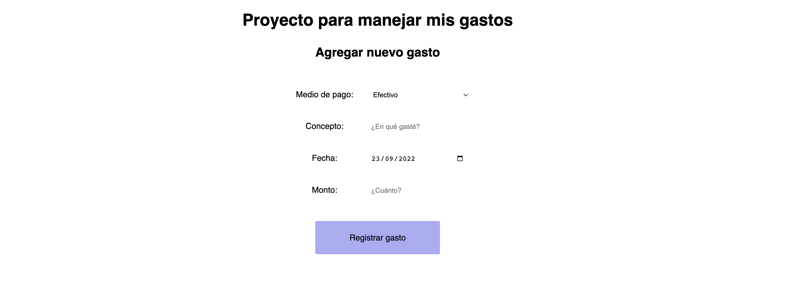

# Creación de Proyecto Final

En esta lección realizaremos un Proyecto Final con los conceptos y herramientas que aprendimos a lo largo del curso. Esto lo realizaremos siguiendo estos pasos:
* Formulación del problema
* Diseño de la solución
* Codificación

## Formulación del problema

Es una descripción concisa de la situación que debe mejorarse. Describe la situación actual (el problema) y el estado deseado (objetivo).

Por ejemplo: No puedo determinar en qué estoy gastando mi dinero actualmente. Quiero llevar un registro de mis gastos: conceptos, montos, fechas y medios de pago.

## Diseño de la solución

¿Cómo vamos a solucionar el problema? ¿Qué necesitamos para esto? 

Para solucionar el problema vamos a implementar una aplicación web estructurada de la siguiente forma:
* Un campo de texto para concepto: en qué usamos el dinero.
* Un combobox para seleccionar el medio de pago: tarjeta de crédito, tarjeta de débito o efectivo.
* Un selector de fecha: cuándo usamos el dinero. Preseleccionaremos la fecha de hoy.
* Un campo numérico para el monto.
* Un botón para registrar el gasto: al hacer click en este botón vamos a realizar una solicitud a la API de Google Sheets para enviar los datos y que se registren en nuestra planilla de gastos.

En esta etapa también podemos realizar un diseño de cómo se verá nuestra aplicación web.



## Codificación
Una vez que tenemos la formulación del problema y el diseño de la solución, podemos pasar a la codificación de la solución. Para esto tendremos tres archivos, similar a los que utilizamos para la app de Menú:
* index.html
* scripts.js
* style.css

### HTML
Aquí pondremos los elementos mencionados en el apartado de diseño de la solución. También podemos incluir los scripts (scripts.js) y los estilos (style.css) que completaremos luego.

Notemos que el botón Registrar gasto invoca a la función onRegistrarGasto. Esta función también incluiremos en nuestros scripts.

```html
<meta charset="UTF-8">
<head>
  <link rel="stylesheet" href="style.css">
</head>

<h1>Proyecto para manejar mis gastos</h1>
<h2>Agregar nuevo gasto</h2>

<div id="form-box">
<form>
  <div>
    <span>Medio de pago:</span> 
      <select id="medio-pago">
          <option value="Tarjeta de crédito">Tarjeta de crédito</option>
          <option value="Tarjeta de débito">Tarjeta de débito</option>
          <option value="Efectivo">Efectivo</option>
      </select>
  </div>
  
  <div>
    <span>Concepto:</span> <input type="text" id="concepto" class="input" placeholder="¿En qué gasté?">
  </div>
  
  <div>
    <span>Fecha:</span> <input type="date" class="input" id="fecha">
  </div>
  
  <div>
    <span>Monto:</span> <input type="number" class="input" id="monto" placeholder="¿Cuánto?">
  </div>
  
</form>
</div>

<div id="button" class="button" onclick="onRegistrarGasto()">Regist rar gasto</div>

<script src="scripts.js"></script>
```

### CSS
Una vez que tenemos nuestro HTML, podemos agregar los estilos como sigue:

```css
h1 {
  text-align: center;
  margin-top: 30px;
  font-family: 'Roboto', sans-serif;
}

h2 {
  text-align: center;
  margin-top: 30px;
  font-family: 'Roboto', sans-serif;
  margin-bottom: 50px;
}

select, input {
  margin-bottom: 25px;
  padding: 10px;
  width: 200px;
  border-radius: 3px;
  border: 0;
}

span {
  display: inline-block;
  width: 150px;
}

#form-box {
  text-align: center;
  margin-top: 30px;
  font-family: 'Roboto', sans-serif;
}

.button {
  font-family: 'Roboto', sans-serif;
  background-color: #ABABF0;
  position: relative;
  top: 0;
  padding: 20px;
  text-align: center;
  line-height: 24px;
  width: 200px;
  border-radius: 3px;
  cursor: pointer;
  margin: auto;
}
```

Ahora podremos abrir el archivo index.html en nuestro navegador y observamos que ya se muestra según nuestro diseño. Solo nos falta agregarle comportamiento.

## Javascript

Finalmente, nos encargamos de que nuestra aplicación funcione según lo que especificamos en la formulación y diseño. Para esto vamos a inicializar la fecha con la de hoy como sigue:

```javascript
document.getElementById('fecha').valueAsDate = new Date();
```

Además, crearemos la función onRegistrarGasto mencionada anteriormente, que será la encargada de realizar lo siguiente:
* Obtener los datos del formulario
```javascript
const medioPago = document.getElementById('medio-pago').value;
const concepto = document.getElementById('concepto').value;
const fecha = document.getElementById('fecha').value;
const monto = document.getElementById('monto').value;
```

* Crear el JSON que será enviado a la API. En este caso debemos tener en cuenta el formato:
```javascript
{
   "range": "hojaGastos",
   "majorDimension": "ROWS",
   "values": [
       [
           "Tarjeta de débito",
           "hamburguesa con queso",
           "2022-09-23",
           "15000"
       ]
   ]
}
```
Esto lo realizamos con el siguiente código:

```javascript
let data = {};
let values = [];
let fila = [medioPago, concepto, fecha, monto];
 
values.push(fila);
data.range = "hojaGastos";
data.majorDimension = "ROWS";
data.values = values;
```

* Enviar los datos del formulario a la API de Google Sheets.
```javascript
  fetch(
    `https://sheets.googleapis.com/v4/spreadsheets/${SHEET_ID}/values/hojaGastos:append?valueInputOption=USER_ENTERED`,
    {
      method: 'POST',
      headers: {
        "Content-Type": "application/json",
        Authorization: `Bearer ${ACCESS_TOKEN}`,
      },
      body: JSON.stringify(data)
    }
  ).then(function (response) {
    response.json().then(function (data) {

    });
  });
```

* Limpiar los datos del formulario de modo a que se pueda cargar un nuevo gasto:
```javascript
document.getElementById('concepto').value = "";
document.getElementById('fecha').valueAsDate = new Date();
document.getElementById('monto').value = "";
```

Con esto nuestro archivo completo de scripts.js quedará de la siguiente forma:

```javascript
const ACCESS_TOKEN =
  "ya29.a0Aa4xrXPvrY1oMKlVO0JOrxEt022XgNW65Ehra38AyPoi782ctna-p7hkGFKqsGzZ5a2T-Ji9j1O4QUAKhAck65a4pZu6s8QulCcgQV0VcQkdVQOeRFBv86It8yktJvn7PC_bCymDko1cvbEgSOp7H_g9nGq74AaCgYKATASARASFQEjDvL976q-NupiVLevCIQ67CX12g0165";
 
const SHEET_ID = '1yqsG8wOfGvcfrAMRPVS-p51A8SF9Q3aeGQZcRycHtK8';

//Inicializamos la fecha a la fecha de hoy
document.getElementById('fecha').valueAsDate = new Date();


function onRegistrarGasto() {

  //Obtenemos los datos del formulario
  const medioPago = document.getElementById('medio-pago').value;
  const concepto = document.getElementById('concepto').value;
  const fecha = document.getElementById('fecha').value;
  const monto = document.getElementById('monto').value;
  
  //Creamos el JSON que espera nuestra API
  let data = {};
  
  let values = [];
  
  let fila = [medioPago, concepto, fecha, monto];

  values.push(fila);
  
  //Verificar que coincida con el nombre de la hoja de nuestro sheet
  data.range = "hojaGastos";
  
  data.majorDimension = "ROWS";
  data.values = values;

  //Invocamos al método POST de la API
  fetch(
    `https://sheets.googleapis.com/v4/spreadsheets/${SHEET_ID}/values/hojaGastos:append?valueInputOption=USER_ENTERED`,
    {
      method: 'POST',
      headers: {
        "Content-Type": "application/json",
        Authorization: `Bearer ${ACCESS_TOKEN}`,
      },
      body: JSON.stringify(data)
    }
  ).then(function (response) {
    response.json().then(function (data) {

    });
  });

  //Limpiamos los campos del formulario para permitir cargar un nuevo gasto
  document.getElementById('concepto').value = "";
  document.getElementById('fecha').valueAsDate = new Date();
  document.getElementById('monto').value = "";
};
```

Y listo. Tenemos nuestra aplicación para registrar gastos.

# Desafío

Crea tu propia aplicación web. ¿Cuál es el problema que querés resolver? Seguí los pasos de esta clase:
* Formulación del problema
* Diseño de la solución
* Codificación
  * HTML
  * CSS
  * Javascript
